# Architecture Specification: Repository Intelligence & Code Review Platform

**Document Version:** 1.0.0  
**Status:** Approved for Core Engineering Implementation  
**Target Audience:** Principal Engineers, Software Architects, Core Backend/Frontend Engineers, AI/ML Infrastructure Engineers  
**Date:** July 2026  

---

## 1. High-Level System Overview

The **Repository Intelligence & Code Review Platform** is an enterprise-grade, graph-aware, multi-agent code analysis platform. Unlike conventional AI code review tools that rely on isolated diff snippets or naive text chunking, this platform constructs a deterministic, incremental **Repository Knowledge Graph (RKG)** using static analysis and Tree-Sitter AST parsing.

By unifying structural graph traversal (callers, callees, type hierarchies, interface implementations, and unit test mappings) with vector-based semantic retrieval, the **Context Retrieval Engine (CRE)** extracts precise, minimal subgraphs (< 2,000 tokens). These payloads are dispatched to a multi-agent review pipeline coordinated via a unified **AI Provider Abstraction Layer (PAL)** supporting both enterprise cloud LLMs and privacy-first, air-gapped local models.

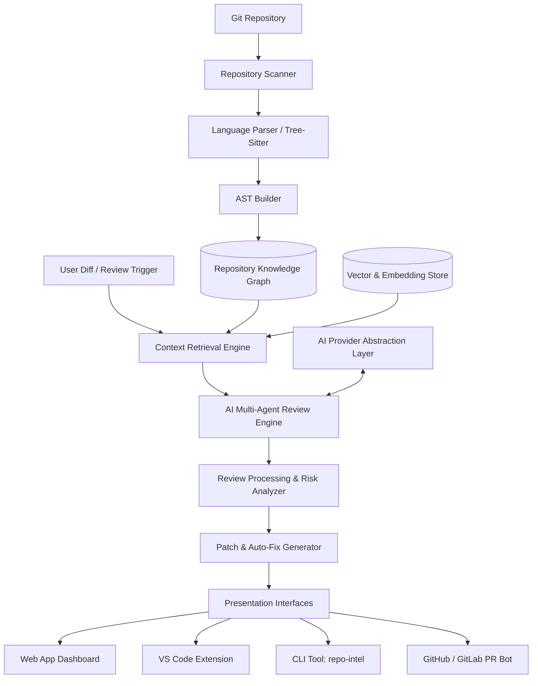

---

## 2. Overall Request Flow

The system operates across two primary execution cycles: the **Asynchronous Indexing Lifecycle** and the **Synchronous/On-Demand Review Lifecycle**.

### 2.1 Complete System Lifecycle

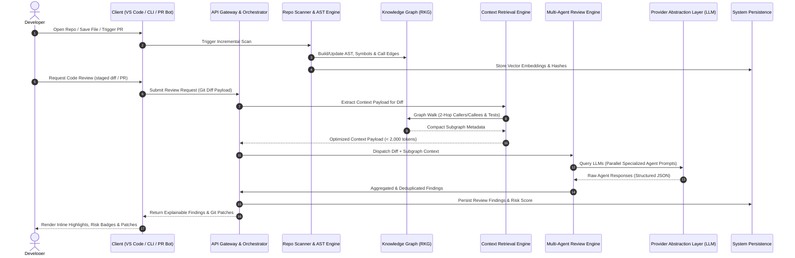

---

## 3. Repository Processing Pipeline

The repository processing pipeline is an automated, stage-gated pipeline responsible for converting raw source code into a queryable Repository Knowledge Graph.

```mermaid
flowchart LR
    DetectRepo[1. Repo Detection] --> DetectLang[2. Language Detection]
    DetectLang --> DiscoverFiles[3. File Discovery]
    DiscoverFiles --> IncIndex[4. Incremental Indexing]
    IncIndex --> ParseAST[5. AST Parsing]
    ParseAST --> SymRes[6. Symbol Resolution]
    SymRes --> CallGraph[7. Call Graph Gen]
    CallGraph --> DepGraph[8. Dependency Graph]
    DepGraph --> KnowledgeGraph[9. Knowledge Graph]
    KnowledgeGraph --> Embeddings[10. Vector Embeddings]
    Embeddings --> Cache[11. Cache Warmup]
    Cache --> Ready[12. Ready for AI]
```

### Stage Responsibilities & Contracts

1. **Repository Detection:** Identifies git root boundaries, working directory structure, submodules, and `.git` metadata.
2. **Language Detection:** Uses file extensions, linguist rules, and shebang inspection to map files to Tree-Sitter grammars.
3. **File Discovery:** Scans file trees while enforcing `.gitignore`, `.ignore`, and custom `.repo-intel-ignore` rules.
4. **Incremental Indexing:** Evaluates file SHA-256 state hashes against stored index states to skip unchanged files.
5. **AST Parsing:** Executes high-speed Tree-Sitter parsing to generate Concrete Syntax Trees (CSTs) and AST nodes.
6. **Symbol Resolution:** Extracts class, interface, function, method, enum, variable, and decorator symbols with line ranges.
7. **Call Graph Generation:** Links function call-sites to explicit symbol declarations across imported modules.
8. **Dependency Graph Construction:** Establishes file-to-file and module-to-module import/export mapping.
9. **Knowledge Graph Ingestion:** Writes normalized nodes and property edges to the graph database.
10. **Vector Embedding Generation:** Computes semantic embeddings for docstrings, function summaries, and README specs.
11. **Caching & Warmup:** Pre-populates LRU caches with top-ranked entry points and structural graph traversals.
12. **Ready for AI:** Emits `INDEXING_COMPLETE` event to unlock low-latency retrieval queries.

---

## 4. Layered Architecture

The application enforces a strict, unidirectional layered architecture. Upper layers consume lower layers via explicit interfaces, preventing horizontal leaks or circular dependencies.

```mermaid
graph TD
    Presentation[1. Presentation Layer (VS Code / Web UI / CLI / PR Bot)]
    Application[2. Application Layer (Orchestration, Workflows, Event Bus)]
    RepoIntel[3. Repository Intelligence Layer (Scanner, AST, Symbol Resolver)]
    GraphLayer[4. Graph Layer (Knowledge Graph, Schema, Cypher Engine)]
    AILayer[5. AI & Multi-Agent Layer (PAL, Agents, Prompt Engine)]
    Persistence[6. Persistence Layer (Relational DB, Vector Store, Caching)]
    Infrastructure[7. Infrastructure Layer (OS, System IPC, Network, Hardware)]

    Presentation --> Application
    Application --> RepoIntel
    Application --> AILayer
    RepoIntel --> GraphLayer
    AILayer --> GraphLayer
    GraphLayer --> Persistence
    AILayer --> Persistence
    RepoIntel --> Infrastructure
    Persistence --> Infrastructure
```

### Layer Responsibilities

* **Presentation Layer:** Handles user interactions, client-side rendering (React, VS Code WebView), CLI command parsing, and GitHub webhook event ingestion.
* **Application Layer:** Manages application state, coordinates asynchronous task queues, enforces rate limits, and coordinates cross-layer workflows.
* **Repository Intelligence Layer:** Encapsulates AST parsing, tree-sitter grammars, symbol resolution logic, and diff patch generation.
* **Graph Layer:** Provides graph abstraction, node/edge schema definitions, traversal algorithms, and query generation.
* **AI & Multi-Agent Layer:** Manages agent prompts, multi-agent orchestration, output validation, and provider adapter routing via PAL.
* **Persistence Layer:** Manages connections and data access for relational tables, graph stores, vector indexes, and key-value caches.
* **Infrastructure Layer:** Handles local file system access, network sockets, child process management, thread pools, and GPU bindings.

---

## 5. Repository Intelligence Engine

The Repository Intelligence Engine contains core sub-modules responsible for code comprehension:

```mermaid
graph LR
    subgraph RepoIntelEngine[Repository Intelligence Engine]
        Scanner[Scanner Module]
        LangDetector[Language Detector]
        ParserManager[Parser Manager]
        ASTEngine[AST Engine]
        SymbolResolver[Symbol Resolver]
        DepBuilder[Dependency Builder]
        CallGraphBuilder[Call Graph Builder]
        ImportGraphBuilder[Import Graph Builder]
        InheritanceBuilder[Inheritance Graph Builder]
        ConfigParser[Configuration Parser]
        MetadataGen[Metadata Generator]
    end
```

### Module Inputs & Outputs

| Sub-Module | Primary Input | Primary Output | Responsibility |
| :--- | :--- | :--- | :--- |
| **Scanner Module** | Directory Path / Git Diff | File Manifest & Hashes | Scans file tree, computes SHA-256 hashes, filters ignored paths. |
| **Language Detector** | File Path & Header | Language Identifiers | Maps files to Tree-Sitter language grammars. |
| **Parser Manager** | File Content & Language | Tree-Sitter CST/AST | Instantiates and pools language parser instances safely. |
| **AST Engine** | AST Syntax Nodes | Structured AST Symbol Map | Navigates syntax trees to extract structural code entities. |
| **Symbol Resolver** | AST Symbol Map | Resolved Global Symbols | Resolves scoped identifiers to canonical symbol IDs. |
| **Dependency Builder** | Resolved Symbols | Module Dependency Map | Computes module-level coupling and dependency matrices. |
| **Call Graph Builder** | Function Invocations | Direct Call Edges | Links function calls to candidate declaration target nodes. |
| **Import Graph Builder** | Import Statements | File-to-File Import Edges | Maps absolute and relative import/export dependencies. |
| **Inheritance Builder** | Class/Interface Decls | Class Hierarchy Edges | Builds `INHERITS` and `IMPLEMENTS` directional graph links. |
| **Configuration Parser** | Config Files (`tsconfig`, `pyproject`) | Structured Compiler/Linter Config | Extracts compiler options, linter rules, and build flags. |
| **Metadata Generator** | Repository State | Repository Summary Payload | Calculates LOC, language distribution, and complexity metrics. |

---

## 6. Knowledge Graph Architecture

The **Repository Knowledge Graph (RKG)** represents source code as a typed property graph.

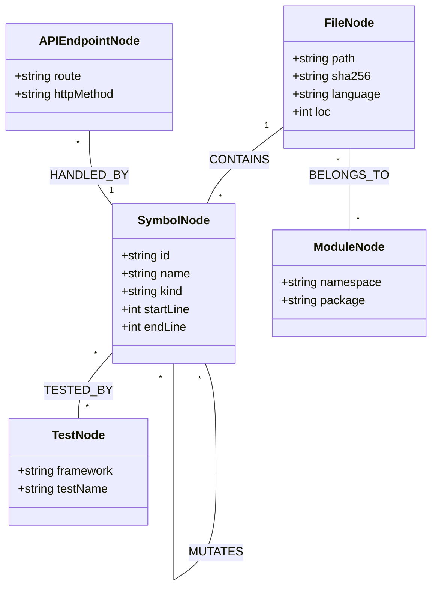

### Graph Schema Specification

* **Node Types:** `File`, `Module`, `Package`, `Class`, `Interface`, `Function`, `Variable`, `APIEndpoint`, `DatabaseModel`, `ConfigurationKey`, `UnitTest`.
* **Edge Relationships:**
  * `CONTAINS`: `File` $\rightarrow$ `Symbol`
  * `IMPORTS`: `File` $\rightarrow$ `File` / `Module`
  * `CALLS`: `Function` $\rightarrow$ `Function`
  * `INHERITS_IMPLEMENTS`: `Class` $\rightarrow$ `Class` / `Interface`
  * `MUTATES`: `Function` $\rightarrow$ `Variable`
  * `TESTED_BY`: `Symbol` $\rightarrow$ `UnitTest`
  * `CONFIGURES`: `ConfigurationKey` $\rightarrow$ `Module`

### Context Retrieval Graph Traversal Algorithm

When retrieving context for a modified function `F`:

1. Locate Node `F` in RKG.
2. Execute 2-hop upstream traversal: $\text{Match } (C)-[:CALLS]\rightarrow(F)$ to find callers impacted by contract changes.
3. Execute 2-hop downstream traversal: $\text{Match } (F)-[:CALLS]\rightarrow(D)$ to verify downstream parameter expectations.
4. Traversal `TESTED_BY` edges: $\text{Match } (F)-[:TESTED_BY]\rightarrow(T)$ to pull existing unit tests.

---

## 7. Context Retrieval Engine (CRE)

The **Context Retrieval Engine (CRE)** implements a hybrid retrieval framework combining graph traversal with vector similarity search.

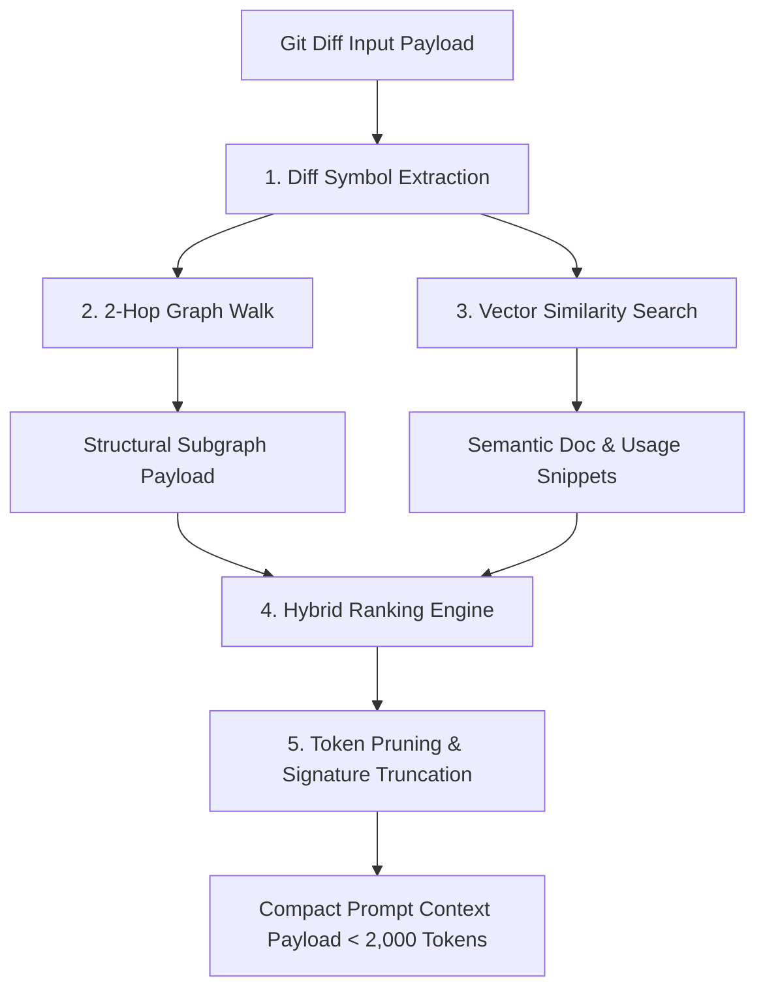

### Why Graph + Semantic Retrieval Superiority

| Dimension | Naive Vector Search (RAG) | RKG Hybrid Retrieval (CRE) |
| :--- | :--- | :--- |
| **Call Chain Context** | Misses indirect callers due to low text similarity. | Guarantees 100% precision on 2-hop caller/callee graphs. |
| **Type & Signature Safety** | Truncates interface definitions if stored in separate files. | Explicitly retrieves `INHERITS_IMPLEMENTS` interface nodes. |
| **Token Budget Efficiency** | Dumps full 500-line files containing matching chunks. | Truncates function bodies to signatures except for modified scopes. |
| **Hallucination Rate** | High (retrieves irrelevant text with high cosine similarity). | Extremely Low (grounded strictly in AST & call graph structure). |

---

## 8. AI Architecture & Provider Abstraction Layer (PAL)

The **AI Provider Abstraction Layer (PAL)** decouples review logic from underlying AI model providers.

```mermaid
graph TD
    Agent[Review Agent] --> PALInterface[Provider Abstraction Interface]
    
    PALInterface --> Router[Provider Router & Fallback Chain]
    
    Router --> AdapterOpenAI[OpenAI Adapter]
    Router --> AdapterClaude[Anthropic Claude Adapter]
    Router --> AdapterGemini[Google Gemini Adapter]
    Router --> AdapterOllama[Ollama Adapter (Local)]
    Router --> AdapterVLLM[vLLM Adapter (Local)]
    Router --> AdapterGroq[Groq / DeepSeek Adapter]
    
    AdapterOpenAI --> APIOpenAI[OpenAI API]
    AdapterClaude --> APIClaude[Anthropic API]
    AdapterOllama --> APILocal[Local GPU / CPU Runner]
```

### Provider Abstraction Contract

Every provider adapter implements a standardized interface:

```md
ProviderAdapter Interface:
  - initialize(config: ProviderConfig): Void
  - complete(prompt: PromptPayload): CompletionResponse
  - streamComplete(prompt: PromptPayload, callback: StreamChunkCallback): Void
  - validateCapabilities(): CapabilitiesMatrix
  - getHealthStatus(): HealthStatus
```

### Resilience & Rate Limit Policy

* **Fallback Chain:** e.g., Primary: `vLLM (Local)` $\rightarrow$ Secondary: `Claude 3.5 Sonnet` $\rightarrow$ Tertiary: `GPT-4o`.
* **Exponential Backoff Retries:** 3 retries with jitter for $5xx$ errors or network timeouts.
* **Leaky Bucket Rate Limiting:** Enforces client-side token-per-minute (TPM) and request-per-minute (RPM) limits before executing HTTP calls.

---

## 9. Multi-Agent Review System

The review engine uses highly specialized, decoupled agents executed in parallel.

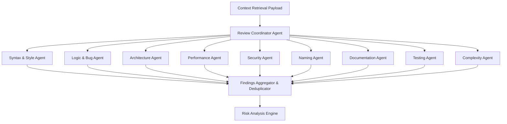

### Structured Finding Schema

All agents emit findings strictly conforming to a JSON schema containing `findingId`, `category`, `severity` (`LOW`, `MEDIUM`, `HIGH`, `CRITICAL`), `confidenceScore` ($0.0 - 1.0$), `file`, `lineRange`, `explanation` (`whatIsWrong`, `whyItMatters`, `impactedComponents`), `evidenceChain`, and `suggestedFix`.

---

## 10. Prompt Generation Pipeline

The prompt generation pipeline translates retrieved subgraphs into optimized LLM prompts.

```mermaid
flowchart LR
    CREPayload[CRE Context Payload] --> TemplateSel[1. Template Selection]
    TemplateSel --> SystemPrompt[2. System & Role Injection]
    SystemPrompt --> RepoSummary[3. Repo Summary Ingestion]
    RepoSummary --> InjectDiff[4. Diff & Subgraph Injection]
    InjectDiff --> FewShot[5. Few-Shot Example Packing]
    FewShot --> FormatProvider[6. Provider Formatting]
    FormatProvider --> TokenCheck[7. Token Window Validation]
    TokenCheck --> ReadyPrompt[Final Prompt String]
```

---

## 11. Review Pipeline

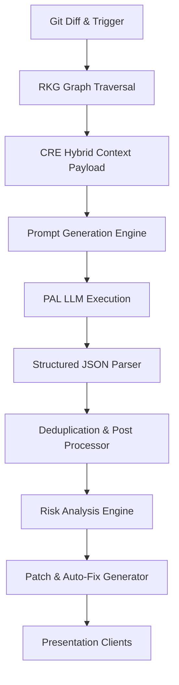

---

## 12. Risk Analysis Engine

The Risk Analysis Engine calculates a quantitative score representing regression risk:

$$\text{Risk Score} = w_1 \cdot (\text{Downstream Callers}) + w_2 \cdot (\text{Criticality Rating}) + w_3 \cdot (1 - \text{Test Coverage})$$

* **Low Risk ($0.0 - 0.35$):** Isolated changes; localized impact.
* **Medium Risk ($0.36 - 0.65$):** Modifies functions with 2–5 callers; covered by unit tests.
* **High Risk ($0.66 - 0.85$):** Modifies public API signatures or shared database models.
* **Critical Risk ($0.86 - 1.00$):** Architectural boundary violations or breaking changes on untested core paths.

---

## 13. Auto Fix Pipeline

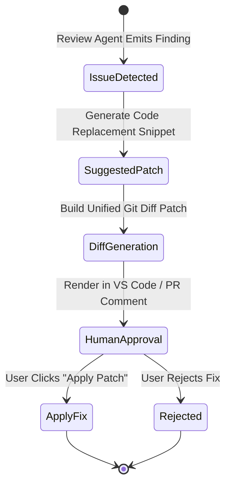

> **Strict Architectural Constraint:** The system will **NEVER** automatically commit or merge code without explicit human confirmation.

---

## 14. Repository Memory

The Repository Memory module provides continuous learning capabilities across review cycles:

* **Ignored Finding Store:** Persists user-dismissed findings to prevent re-flagging similar patterns.
* **Convention Learning Engine:** Mines repository commit history to build custom naming and style rule embeddings.
* **Historical Comparison Engine:** Tracks architectural debt metrics over time across release branches.

---

## 15. Storage Architecture

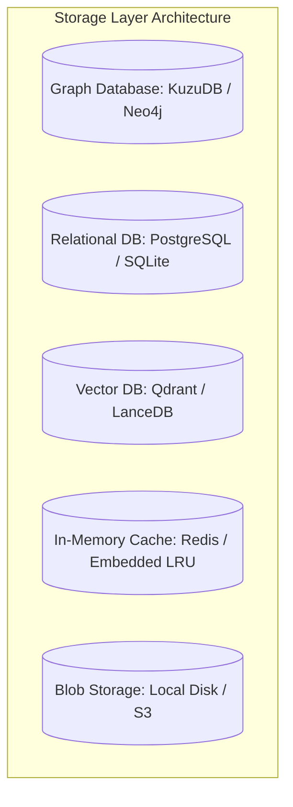

| Data Category | Target Storage Technology | Rationale |
| :--- | :--- | :--- |
| **Knowledge Graph** | Embedded KùzuDB / Neo4j | High-performance Cypher queries for multi-hop graph walks. |
| **Review & Issue History** | PostgreSQL / SQLite | ACID compliance for transaction logs, user settings, and audit trails. |
| **Symbol & Doc Embeddings** | LanceDB / Qdrant | Low latency vector distance queries with scalar metadata filters. |
| **Graph & AST Cache** | Redis / Local Memory LRU | Sub-millisecond lookup for hot AST nodes and frequent queries. |
| **Patch & Report Bloats** | Local Disk Storage / S3 | Efficient storage of raw patch files and detailed HTML reports. |

---

## 16. Caching Strategy

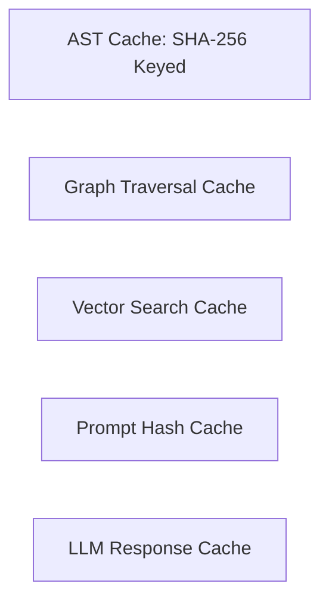

* **Invalidation Policy:** AST and Graph caches invalidate automatically per file when the file's SHA-256 hash changes. Prompt and LLM response caches use exact prompt payload hashing with a 7-day TTL.

---

## 17. Authentication & Security

* **AuthN & AuthZ:** JWT with OAuth2 for GitHub/GitLab SSO; Role-Based Access Control (RBAC: Admin, Architect, Developer, Auditor).
* **Workspace Isolation:** Multi-tenant workspace data isolation at database and graph query levels.
* **Local Security Guarantee:** 100% offline execution capability when using local LLMs (Ollama/vLLM) with zero telemetry calls.

---

## 18. Frontend Architecture

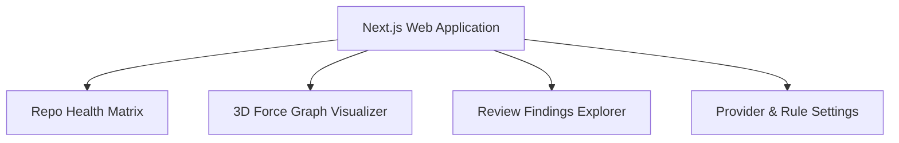

---

## 19. VS Code Extension Architecture

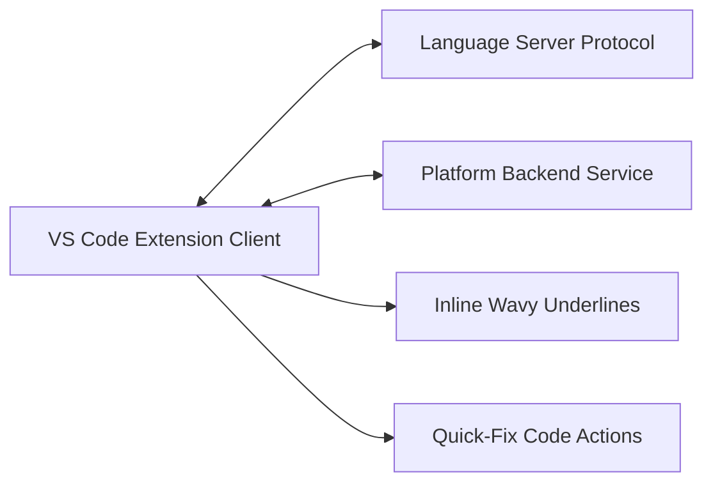

---

## 20. GitHub Integration

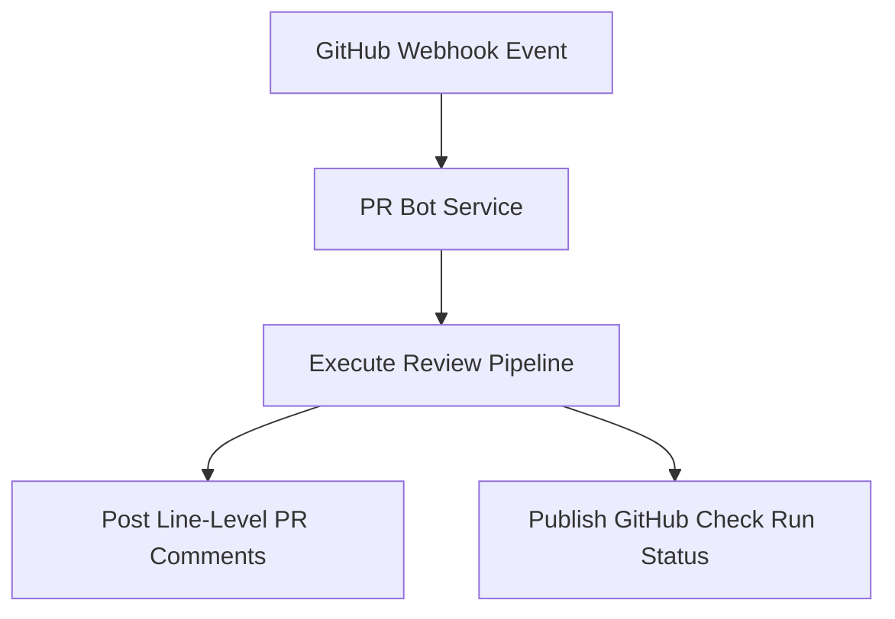

---

## 21. CLI Architecture (`repo-intel`)

```text
repo-intel <command> [options]

Commands:
  init       Initialize repository index and configuration
  review     Execute code review on staged changes or commits
  analyze    Run a specific agent on the repository
  graph      Query or display status of Knowledge Graph
  providers  List and test configured AI providers
  fix        Apply suggested patch file to local workspace
  config     View or set platform configuration parameters
```

---

## 22. REST API Architecture

| Endpoint Method & Path | Summary | Description |
| :--- | :--- | :--- |
| `POST /api/v1/repos/index` | Index Repo | Triggers repository scanner and graph indexing pipeline. |
| `POST /api/v1/reviews/run` | Execute Review | Submits diff payload for multi-agent review execution. |
| `GET  /api/v1/reviews/:id` | Get Review | Fetches review results, findings, and patch diffs. |
| `GET  /api/v1/graphs/subgraph` | Query Graph | Returns subgraph nodes around specified symbol. |
| `GET  /api/v1/providers/health` | Provider Status | Validates connectivity and status of configured AI providers. |

---

## 23. Event Flow Architecture

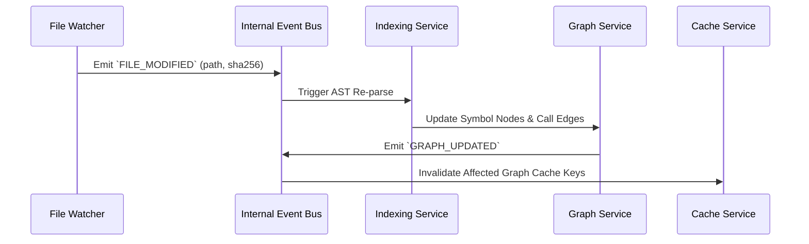

---

## 24. Plugin Architecture

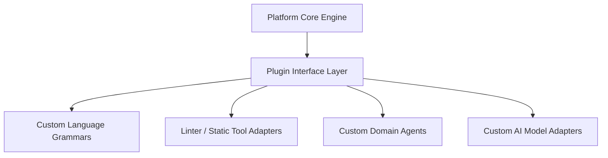

---

## 25. Folder Structure

```text
repo-intelligence-platform/
├── apps/
│   ├── web/                     # Next.js Web Dashboard Application
│   │   ├── src/
│   │   │   ├── components/      # UI components (Graph visualizer, Findings table)
│   │   │   ├── pages/           # Route handlers and views
│   │   │   └── services/        # Web API client adapters
│   ├── vscode/                  # VS Code Extension Codebase
│   │   ├── src/
│   │   │   ├── extension.ts     # Extension entrypoint
│   │   │   ├── lsp/             # Language server client bindings
│   │   │   └── views/           # Sidebar webview provider
│   └── cli/                     # Node.js / Rust CLI Tool (`repo-intel`)
│       ├── src/
│       │   ├── commands/        # CLI subcommands (review, init, graph)
│       │   └── index.ts         # Binary entrypoint
├── packages/
│   ├── parser/                  # Tree-Sitter AST Parsing Package
│   ├── graph/                   # Knowledge Graph Engine & Schemas
│   ├── retrieval/               # Context Retrieval Engine (CRE)
│   ├── ai/                      # AI Provider Abstraction Layer (PAL)
│   ├── review-engine/           # Multi-Agent Coordination Engine
│   ├── agents/                  # Specialized Review Agents (Security, Logic, etc.)
│   ├── patch-gen/               # Unified Diff & Auto-Fix Framework
│   └── shared/                  # Shared TypeScript types and utilities
├── services/
│   ├── api/                     # Backend REST & GraphQL API Gateway
│   ├── indexing/                # Background Incremental Indexing Worker
│   └── pr-bot/                  # GitHub / GitLab Webhook App Handler
├── configs/                     # Default system configurations & linter defaults
├── docs/                        # Architectural specifications and user guides
├── scripts/                     # Build, release, and setup scripts
└── tests/                       # End-to-end and integration test suites
```

---

## 26. Internal Module Structure

### AI Provider Abstraction Layer (`packages/ai/`)

```text
packages/ai/
├── src/
│   ├── base/
│   │   ├── base-provider.ts     # Abstract Provider base class
│   │   └── provider-interface.ts# Common Provider interface definition
│   ├── providers/
│   │   ├── openai-adapter.ts    # OpenAI API adapter implementation
│   │   ├── claude-adapter.ts    # Anthropic Claude API adapter implementation
│   │   ├── gemini-adapter.ts    # Google Gemini API adapter implementation
│   │   ├── ollama-adapter.ts    # Local Ollama runner adapter implementation
│   │   └── vllm-adapter.ts      # Local vLLM API adapter implementation
│   ├── factory/
│   │   └── provider-factory.ts  # Instantiates adapters from runtime configuration
│   └── types/
│       ├── provider-types.ts    # Type definitions for prompts and completion payloads
│       └── capabilities.ts      # Model capabilities matrix schemas
```

---

## 27. Technology Stack Selection Matrix

| Layer | Recommended Option | Alternative Options | Rationale |
| :--- | :--- | :--- | :--- |
| **Frontend Web** | Next.js + React + Cytoscape.js | Vite + React | Modern SSR/SPA support with rich 2D/3D graph visualization libraries. |
| **CLI / Tooling** | Node.js (TypeScript) / Rust | Go | High-performance AST bindings and ecosystem compatibility. |
| **AST Parser** | Tree-Sitter | Babel / ESLint AST | Fast multi-language support with sub-millisecond parsing speed. |
| **Knowledge Graph** | KùzuDB (Embedded) | Neo4j / Memgraph | High performance Cypher graph queries with zero external server requirement in local CLI mode. |
| **Vector Database** | LanceDB (Embedded) | Qdrant / ChromaDB | Disk-backed embedded vector storage suitable for local & cloud deployments. |
| **API Gateway** | Fastify / Node.js | Go (Gin) / Rust (Actix) | High HTTP throughput, low memory footprint, native TypeScript support. |
| **Relational DB** | SQLite (Local) / PostgreSQL | MySQL | Lightweight embedded DB for local CLI mode; enterprise scale for cloud. |

---

## 28. Scalability Strategy

* **Distributed Indexing:** Worker pools partition large repositories by directory subtrees, processing AST parsing in parallel.
* **Graph Partitioning:** Subgraphs are partitioned per repository workspace to ensure multi-tenant query isolation.
* **Token Budget Control:** CRE strictly caps context payload sizes under 2,000 tokens per agent prompt to minimize LLM token consumption and latency.

---

## 29. Deployment Architecture

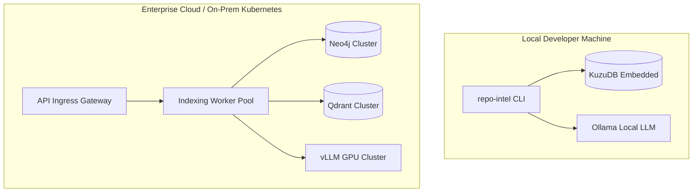

---

## 30. Error Handling & Resiliency

* **Graceful Degradation:** If graph database queries fail or time out, the system falls back to standard file-level diff context parsing.
* **Partial Agent Failure Recovery:** If a specialized agent times out, the Review Aggregator collects findings from surviving agents without failing the entire PR review.

---

## 31. Logging & Observability

* **Structured Logging:** All services emit JSON logs formatted with trace IDs, span IDs, repository IDs, and token usage metrics.
* **OpenTelemetry Tracing:** Traces end-to-end request latency across context retrieval, graph walks, and LLM calls.
* **Prometheus Metrics:** Tracks active indexing jobs, cache hit/miss ratios, LLM token rates, and agent execution times.

---

## 32. Security Architecture

* **Zero IP Leakage:** In air-gapped mode, network interfaces to external endpoints are disabled; all inference routes to local GPUs.
* **Secrets Handling:** API keys for cloud providers are stored in encrypted system keyrings (local) or AWS KMS / HashiCorp Vault (cloud).
* **Sanitizing Code Snippets:** Code snippets attached to review findings are checked for embedded hardcoded secrets before rendering.

---

## 33. Future Evolution

The architecture is designed to evolve into a continuous **Repository Intelligence Platform**:

1. **Continuous Technical Debt Tracking:** Tracks historical trends in cyclomatic complexity, layer coupling, and test coverage gaps.
2. **AI Software Architect:** Conversational architectural agent capable of planning and executing repository-wide refactoring workflows.
3. **Continuous Code Quality Monitoring:** Hooks into CI/CD pipelines to block architectural drift and circular dependency regressions automatically.
