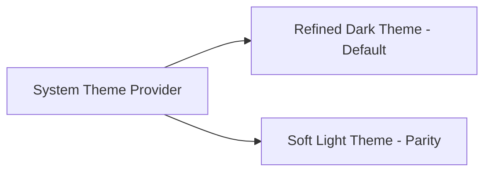
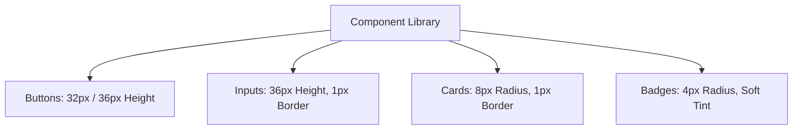
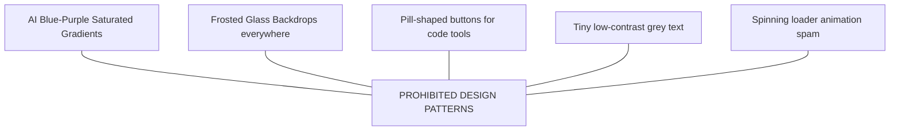

# Design System Specification: Repository Intelligence & Code Review Platform

**Document Version:** 1.0.0  
**Status:** Canonical Design & UI System Specification  
**Target Audience:** Frontend Engineers, UI/UX Designers, Design Systems Engineers, AI UI Generators (Stitch)  
**Date:** July 2026

---

## 1. Brand Personality

The visual identity of the **Repository Intelligence & Code Review Platform** is engineered to feel like a
high-precision, enterprise-grade developer tool (in the spirit of Linear, GitHub, Vercel, Raycast, and Cursor) rather
than a flashy, consumer-facing AI demonstration.

```md
+-------------------------------------------------------------------------+ | BRAND
IDENTITY | | [Precise] [Intelligent] [Calm] [Minimal] [Developer-First] | +-------------------------------------------------------------------------+
```

### Personality Pillars

- **Trust & Precision:** The interface looks deterministic and reliable. Crisp borders, sharp typography, and subtle
  contrast inspire confidence in AI findings.
- **Calm & Uncluttered:** Eliminates visual noise. Dark mode is tuned for long coding sessions without eye strain.
- **Intelligent & Subtle:** AI features are integrated seamlessly into standard code review workflows rather than hidden
  behind gimmicky chatbot bubbles or glowing neon effects.

### What the UI MUST NOT Feel Like

- **NOT Playful or Cartoonish:** No friendly avatars, bubbly rounded cards, or gamified progress bars.
- **NOT Cyberpunk or Neon:** No glowing cyan/magenta neon borders, dark void backgrounds with neon text, or sci-fi HUDs.
- **NOT Generic "AI Blue-Purple":** Avoid overuse of saturated purple-to-blue gradients
  (`linear-gradient(to right, #6366f1, #a855f7)`).
- **NOT Heavy Glassmorphism:** No excessive backdrop blurs or translucent frosted glass that compromises text
  legibility.

---

## 2. Core Design Principles

1. **Content First (Code Over Chrome):** The user's source code, AST graph nodes, and review findings take 80%+ of
   visual real estate. UI chrome is minimal.
2. **Function Over Decoration:** Every line, border, background color, and badge serves an informational purpose.
3. **Consistency Before Creativity:** Identical interactions use identical components, padding, and hover behaviors
   across all screens.
4. **Accessibility by Default:** Text contrast ratios meet or exceed WCAG 2.1 AA standard ($4.5:1$ for normal
   text, $3.0:1$ for large text and UI boundaries).
5. **Information Hierarchy & Progressive Disclosure:** Surface high-level risk badges and critical findings first; allow
   deep-diving into evidence chains and AST caller graphs on demand.
6. **Minimal Visual Noise:** Rely on subtle background shifts and precise $1\text{px}$ borders rather than heavy drop
   shadows or bright accent lines.

---

## 3. Theme System

The platform defaults to a **Refined Dark Theme** tailored for dark-mode editor environments (VS Code, JetBrains,
WebStorm) with full parity for a soft, neutral **Light Theme**.



- **Dark Theme (Default):** Deep slate-black background (`#0B0D10`), warm neutral dark-gray surfaces (`#12151A`), crisp
  slate borders (`#222731`), high-contrast off-white text (`#EDEDED`).
- **Light Theme:** Soft neutral paper background (`#F8F9FA`), pure white card surfaces (`#FFFFFF`), neutral borders
  (`#E2E4E9`), high-contrast slate text (`#111827`). Never harsh `#000000` on `#FFFFFF`.

---

## 4. Color Palette

All colors are defined using HSL and HEX formats to support dynamic opacity overlays (`alpha`).

```md
Dark Mode Surfaces:
Background: #0B0D10 (hsl (216, 20%, 5%))
Surface 1: #12151A (hsl (216, 18%, 9%))
Surface 2: #181C23 (hsl (216, 19%, 12%))
Border: #242B35 (hsl (216, 19%, 18%))
Hover: #2A323F (hsl (216, 20%, 21%))

Light Mode Surfaces:
Background: #F8F9FA (hsl (210, 20%, 98%))
Surface 1: #FFFFFF (hsl (0, 0%, 100%))
Surface 2: #F1F3F5 (hsl (210, 14%, 95%))
Border: #E2E4E9 (hsl (210, 14%, 90%))
Hover: #E9ECEF (hsl (210, 14%, 93%))
```

### Complete Color Palette Matrix

| Semantic Token          | Dark Mode HEX          | Light Mode HEX         | Primary Usage                             |
|:------------------------|:-----------------------|:-----------------------|:------------------------------------------|
| `--bg-base`             | `#0B0D10`              | `#F8F9FA`              | Main application viewport background      |
| `--bg-surface`          | `#12151A`              | `#FFFFFF`              | Cards, sidebars, modals, panels           |
| `--bg-surface-elevated` | `#181C23`              | `#F1F3F5`              | Dropdown menus, tooltips, dialogs         |
| `--border-subtle`       | `#1D232C`              | `#ECEEEF`              | Dividers, subtle grid lines               |
| `--border-default`      | `#242B35`              | `#E2E4E9`              | Card borders, input borders               |
| `--border-strong`       | `#364151`              | `#CDD1D9`              | Focused element boundaries, active tabs   |
| `--text-primary`        | `#EDEDED`              | `#111827`              | Headings, primary text, code content      |
| `--text-secondary`      | `#9DA4B0`              | `#4B5563`              | Subtitles, labels, metadata               |
| `--text-muted`          | `#636B78`              | `#9CA3AF`              | Disabled text, placeholders               |
| `--accent-primary`      | `#3B82F6`              | `#2563EB`              | Primary action buttons, active indicators |
| `--accent-hover`        | `#60A5FA`              | `#1D4ED8`              | Hover states on primary elements          |
| `--accent-subtle`       | `rgba(59,130,246,0.1)` | `rgba(37,99,235,0.08)` | Selected item backgrounds                 |
| `--code-bg`             | `#0E1116`              | `#F3F4F6`              | Code editor / viewer background           |

---

## 5. Review Severity & Status Colors

Review findings are categorized into distinct severity states. Colors use high-contrast text pairings with soft
background tint overlays (`0.15` opacity).

```md
CRITICAL: Dark BG: #3A1014 | Text: #FF6B6B | Border: #842029 (Red)
HIGH: Dark BG: #341D09 | Text: #FFA94D | Border: #7A4310 (Orange)
MEDIUM: Dark BG: #2D2605 | Text: #FCC419 | Border: #6B5B00 (Yellow)
LOW: Dark BG: #0C2340 | Text: #4DABF7 | Border: #18497A (Blue)
INFO: Dark BG: #122019 | Text: #51CF66 | Border: #1B4D2E (Green)
```

### Review Status Palette

| Severity / Status | Dark Theme Text | Dark Theme Badge BG | Light Theme Text | Light Theme Badge BG |
|:------------------|:----------------|:--------------------|:-----------------|:---------------------|
| **Critical**      | `#FF6B6B`       | `#3A1014`           | `#C92A2A`        | `#FFF5F5`            |
| **High**          | `#FFA94D`       | `#341D09`           | `#D9480F`        | `#FFF4E6`            |
| **Medium**        | `#FCC419`       | `#2D2605`           | `#E67700`        | `#FFF9DB`            |
| **Low**           | `#4DABF7`       | `#0C2340`           | `#1864AB`        | `#E7F5FF`            |
| **Info / Pass**   | `#51CF66`       | `#122019`           | `#2B8A3E`        | `#E6FCF5`            |
| **Resolved**      | `#868E96`       | `#1A1D20`           | `#495057`        | `#F1F3F5`            |
| **Suggested Fix** | `#63E6BE`       | `#0A251D`           | `#0CA678`        | `#E6FCF5`            |

---

## 6. Typography System

The platform uses two carefully selected, highly legible font families:

- **Primary UI Font:** **Inter** (Fallback: `system-ui`, `-apple-system`, `BlinkMacSystemFont`, `sans-serif`).
    - _Rationale:_ Industry standard for developer interfaces (Linear, Vercel). Neutral letterforms, exceptional
      legibility at $11\text{px}-14\text{px}$, and tabular numeric support (`font-variant-numeric: tabular-nums`).
- **Monospace Code Font:** **JetBrains Mono** (Fallback: `Geist Mono`, `Fira Code`, `ui-monospace`, `monospace`).
    - _Rationale:_ Engineered specifically for code reading with clear distinction between `0`/`O` and `1`/`l`/`I`,
      increased height-to-width ratio, and crisp rendering in editor components.

---

## 7. Typography Scale

```md
Display: 28px / Weight: 600 / Line Height: 34px / Tracking: -0.02em H1: 22px / Weight: 600 / Line Height: 28px /
Tracking: -0.015em H2: 18px / Weight: 600 / Line Height: 24px / Tracking: -0.01em H3: 15px / Weight: 600 / Line Height:
20px / Tracking: 0 H4: 13px / Weight: 600 / Line Height: 18px / Tracking: 0 Body Lg: 14px / Weight: 400 / Line Height:
20px / Tracking: 0 Body Base: 13px / Weight: 400 / Line Height: 18px / Tracking: 0 Small: 12px / Weight: 400 / Line
Height: 16px / Tracking: 0 Caption: 11px / Weight: 500 / Line Height: 14px / Tracking: 0.01em Code: 12px / Weight: 400 /
Line Height: 18px / JetBrains Mono
```

---

## 8. Spacing System (8-Point Grid)

Layouts enforce a strict 8-point spatial rhythm with 4-point steps for dense UI controls.

```md
--space-1: 4px (Tight inline gaps, badge padding)
--space-2: 8px (Button padding vertical, icon gaps)
--space-3: 12px (Card internal padding tight, input padding horizontal)
--space-4: 16px (Standard card padding, panel gutters)
--space-6: 24px (Section spacing, page margins)
--space-8: 32px (Major section separation)
--space-10: 40px (Header heights, modal margins)
--space-12: 48px (Hero spacing)
--space-16: 64px (Empty state vertical padding)
```

---

## 9. Border Radius Tokens

- `--radius-sm`: `4px` (Badges, tooltips, inline code tags, table tags).
- `--radius-md`: `6px` (Buttons, inputs, dropdown items, select menus).
- `--radius-lg`: `8px` (Cards, panels, popovers, code viewer containers).
- `--radius-xl`: `12px` (Modals, major dialog windows, command palette).
- `--radius-full`: `9999px` (Avatars, status pills, progress bars).

---

## 10. Elevation & Shadow Tokens

Shadows are soft and diffused, avoiding harsh dark cast shadows.

- `--shadow-none`: `none`
- `--shadow-sm`: `0 1px 2px 0 rgba(0, 0, 0, 0.25)` (Buttons, subtle card elevation)
- `--shadow-md`: `0 4px 12px -2px rgba(0, 0, 0, 0.35)` (Dropdown menus, popovers)
- `--shadow-lg`: `0 12px 32px -4px rgba(0, 0, 0, 0.50)` (Modals, command palette)
- `--shadow-focus`: `0 0 0 2px rgba(59, 130, 246, 0.5)` (Keyboard focus rings)

---

## 11. Iconography System

- **Library:** **Lucide Icons** (`lucide-react`).
- **Style:** Outline style, uniform $1.5\text{px}$ stroke width (scalable to $1.75\text{px}$ for smaller $14\text{px}$
  icons).
- **Standard Sizes:**
    - Small: `14px × 14px` (Inline table icons, badge icons)
    - Medium: `16px × 16px` (Standard button icons, nav items)
    - Large: `20px × 20px` (Page headers, section titles)
    - Feature: `32px × 32px` (Empty state hero icons)

---

## 12. Component Design Language



### Key Component Specifications

- **Buttons:** Height `32px` (Compact) or `36px` (Standard). `font-size: 13px`, `font-weight: 500`.
    - _Primary:_ Background `--accent-primary` (`#3B82F6`), text `#FFFFFF`, border `none`.
    - _Secondary:_ Background `--bg-surface-elevated`, text `--text-primary`, border `1px solid --border-default`.
    - _Ghost:_ Background `transparent`, text `--text-secondary`, hover background `--accent-subtle`.
- **Inputs & Form Controls:** Height `36px`. Background `--bg-base`, border `1px solid --border-default`, focus ring
  `2px solid --accent-primary`.
- **Cards & Containers:** Background `--bg-surface`, border `1px solid --border-default`, radius `8px`, padding `16px`.
- **Badges & Severity Chips:** Height `20px`, padding `0 6px`, radius `4px`, `font-size: 11px`, `font-weight: 600`,
  uppercase tracking `0.02em`.

---

## 13. Layout & Grid System

```md
+-------------------------------------------------------------------------+ | TOP HEADER (Height:
48px) | +------------------+------------------------------------------------------+ | SIDEBAR | MAIN CONTENT
VIEWPORT | | Width: 240px | Flex-1 (Min-width: 0) | | Collapsible | Resizable Split
Panes | +------------------+------------------------------------------------------+ | FOOTER STATUS BAR (Height:
24px) | +-------------------------------------------------------------------------+
```

- **Sidebar Width:** `240px` default (collapsible to `48px` icon bar).
- **Main Content Area:** Fluid width with resizable split panes (`react-resizable-panels`).
- **Breakpoints:**
    - Mobile: $< 768\text{px}$ (Drawer navigation)
    - Tablet: $768\text{px} - 1023\text{px}$ (Collapsed sidebar)
    - Desktop: $1024\text{px} - 1599\text{px}$ (Standard 2-pane view)
    - Ultra-Wide: $\ge 1600\text{px}$ (Expanded 3-pane layout: Explorer + Code + Graph)

---

## 14. Navigation Architecture

- **Command Palette (`Cmd+K` / `Ctrl+K`):** Global modal overlay providing instant keyboard access to repositories,
  review execution, settings, and provider switching.
- **Primary Sidebar:** Vertical navigation listing Dashboard, Repository Explorer, Review Findings, Dependency Graph,
  Provider Config, and Settings.
- **Breadcrumbs Bar:** Top header navigation tracing `Repo Name / Branch / File Path / Symbol Name`.

---

## 15. Dashboard Design Layout

```md
+-------------------------------------------------------------------------+ | Repository Selector Dropdown | Branch:
main | Trigger Review Button | +-------------------------------------------------------------------------+ | HEALTH
METRIC
CARDS | | [Quality Score: 92/100] [Risk: LOW] [Open Findings: 3] [Graph Nodes: 1.4k]| +-------------------------------------------------------------------------+ |
MAIN PANELS (50/50 Split) | | Left: Recent Review Findings Table | Right: 3D Dependency
Subgraph | +-------------------------------------------------------------------------+
```

---

## 16. Code Viewer & Diff Interface

- **Editor Engine:** Monaco Editor / CodeMirror 6 with custom theme matching `--code-bg` (`#0E1116`).
- **Inline Annotations:** Severity-colored squiggly underlines (`1.5px` wavy) on affected code lines.
- **Review Annotation Widget:** Floating inline card inserted directly below flagged line:

```md
+-------------------------------------------------------------------------+ | [CRITICAL] Potential Unsanitized SQL
Injection in User Lookup | | Line 44: const query = `SELECT * FROM users WHERE email = '${email}'`; | | | | Explanation:
Input variable is directly interpolated into raw
SQL. | | [View Evidence Chain] [Apply Fix Patch Button] | +-------------------------------------------------------------------------+
```

---

## 17. 3D & 2D Knowledge Graph Viewer

- **Engine:** Cytoscape.js (2D layout) / Three.js (3D Force Graph).
- **Node Visual Encoding:**
    - `FileNode`: Gray square icon node.
    - `FunctionNode`: Blue circle node.
    - `ClassNode`: Purple diamond node.
    - `UnitTestNode`: Green shield node.
    - `FlaggedRiskNode`: Pulsing Red halo highlight around affected node.
- **Edge Visual Encoding:**
    - `CALLS`: Solid directional arrow line (`#4B5563`).
    - `IMPORTS`: Dashed directional line (`#364151`).
    - `TESTED_BY`: Green dotted line (`#1B4D2E`).

---

## 18. Table Specifications

- **Header Row:** Height `32px`, background `--bg-surface-elevated`, text `--text-secondary`, uppercase `11px`,
  `font-weight: 600`.
- **Data Row:** Height `40px` (Dense) or `48px` (Standard), border-bottom `1px solid --border-subtle`, hover background
  `--accent-subtle`.
- **Features:** Sticky headers, sortable column headers with directional arrows, and inline status badges.

---

## 19. Forms & Inputs

- **Label:** `12px`, `font-weight: 500`, `--text-secondary`, margin-bottom `6px`.
- **Helper Text:** `11px`, `--text-muted`, margin-top `4px`.
- **Validation Error State:** Border `1px solid --severity-critical` (`#FF6B6B`), helper text `#FF6B6B`.

---

## 20. Empty States

Empty states use structured layout blocks with a $32\text{px}$ Lucide outline icon in a soft circular container
(`rgba(59,130,246,0.1)`), an `H3` headline, a 2-line body explanation, and a primary CTA button.

---

## 21. Loading States & Streaming

- **Skeleton Screens:** Animated background pulse
  (`@keyframes pulse { 0%, 100% { opacity: 0.4 } 50% { opacity: 0.8 } }`) on card shapes instead of spinner spam.
- **Streaming Tokens:** LLM review output streams inline with a blinking vertical cursor block (`▋` in
  `--accent-primary`).

---

## 22. Animation & Motion Tokens

- `--duration-fast`: `100ms` (Hover states, color transitions)
- `--duration-normal`: `180ms` (Dropdown openings, tab switches, tooltips)
- `--duration-slow`: `250ms` (Panel collapse/expand, modal overlays)
- `--ease-default`: `cubic-bezier(0.16, 1, 0.3, 1)` (Linear-style snappy deceleration)

---

## 23. Accessibility (WCAG 2.1 AA Compliance)

- **Keyboard Navigation:** Full keyboard navigation support (`Tab`, `Shift+Tab`, `Arrow keys`, `Esc`, `Cmd+K`).
- **Focus Indicators:** Visible `2px` solid focus ring (`--accent-primary`) with `2px` offset on all interactive
  elements.
- **Color Blindness Safety:** Review severities combine color with explicit text labels and icon shapes (e.g., Red
  Triangle for Critical, Yellow Circle for Medium).

---

## 24. Responsive Design System

| Device Breakpoint | Range                           | Navigation Behavior     | Graph Viewer Behavior               |
|:------------------|:--------------------------------|:------------------------|:------------------------------------|
| **Mobile**        | $< 768\text{px}$                | Drawer Menu             | Hidden (replaced with tabular list) |
| **Tablet**        | $768\text{px} - 1023\text{px}$  | Collapsed Sidebar       | 2D Flat Graph view                  |
| **Desktop**       | $1024\text{px} - 1599\text{px}$ | Standard 240px Sidebar  | Full 2D/3D Split Graph Pane         |
| **Ultra-Wide**    | $\ge 1600\text{px}$             | Pin Uncollapsed Sidebar | 3-Pane Expanded View                |

---

## 25. Refined Dark Theme Specification

```css
:root[data-theme="dark"] {
    --bg-base: #0b0d10;
    --bg-surface: #12151a;
    --bg-surface-elevated: #181c23;
    --border-subtle: #1d232c;
    --border-default: #242b35;
    --border-strong: #364151;
    --text-primary: #ededed;
    --text-secondary: #9da4b0;
    --text-muted: #636b78;
    --accent-primary: #3b82f6;
    --code-bg: #0e1116;
}
```

---

## 26. Soft Light Theme Specification

```css
:root[data-theme="light"] {
    --bg-base: #f8f9fa;
    --bg-surface: #ffffff;
    --bg-surface-elevated: #f1f3f5;
    --border-subtle: #eceeef;
    --border-default: #e2e4e9;
    --border-strong: #cdd1d9;
    --text-primary: #111827;
    --text-secondary: #4b5563;
    --text-muted: #9ca3af;
    --accent-primary: #2563eb;
    --code-bg: #f3f4f6;
}
```

---

## 27. Design Tokens Manifest

```json
{
  "color": {
    "bg": {
      "base": "var(--bg-base)",
      "surface": "var(--bg-surface)"
    },
    "border": {
      "default": "var(--border-default)",
      "strong": "var(--border-strong)"
    },
    "text": {
      "primary": "var(--text-primary)",
      "secondary": "var(--text-secondary)"
    }
  },
  "space": {
    "1": "4px",
    "2": "8px",
    "3": "12px",
    "4": "16px",
    "6": "24px",
    "8": "32px"
  },
  "radius": {
    "sm": "4px",
    "md": "6px",
    "lg": "8px",
    "full": "9999px"
  },
  "motion": {
    "fast": "100ms cubic-bezier(0.16, 1, 0.3, 1)",
    "normal": "180ms cubic-bezier(0.16, 1, 0.3, 1)"
  }
}
```

---

## 28. UI Consistency Rules

1. **Fixed Element Heights:** Inputs and primary buttons **MUST** share identical heights (`36px` standard).
2. **Fixed Icon Sizes:** Icons in buttons and menus **MUST** use `$16\text{px} \times 16\text{px}$` with`$1.5\text{px}$`
   stroke.
3. **No Arbitrary Padding:** Spacing **MUST** strictly use design tokens (`--space-2`, `--space-4`, etc.).

---

## 29. Visual Layout Descriptions for Key Screens

### Review Findings Screen

- **Layout:** Split view with 30% left list pane (Filterable findings list sorted by severity) and 70% right code viewer
  pane (Monaco editor highlighting code diff with inline annotation cards).

### Provider Configuration Screen

- **Layout:** Card grid displaying AI provider cards (OpenAI, Anthropic, Ollama, vLLM). Each card shows provider status
  badge (`ONLINE` green dot), model selector dropdown, API key input (masked), and latency response chart.

---

## 30. Design Anti-Patterns (Things to Avoid)



### Prohibited Design Practices

- **No AI Blue-Purple Gradients:** Do NOT use multicolor linear gradients on buttons or headers.
- **No Heavy Glassmorphism:** Do NOT blur backgrounds to the point of unreadability.
- **No Pill Buttons:** Buttons MUST use `--radius-md` (`6px`), never fully rounded pill shapes.
- **No Low-Contrast Text:** Text MUST meet WCAG AA standards. Never use faint gray text on dark gray surfaces.
- **No Spinner Spam:** Skeletons and inline token streams MUST be used instead of full-screen loading spinners.
