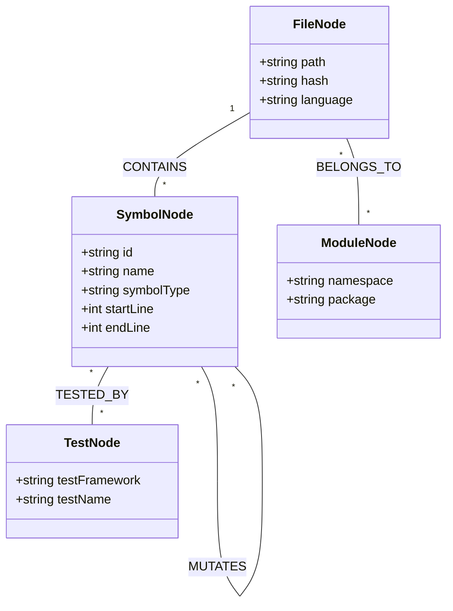
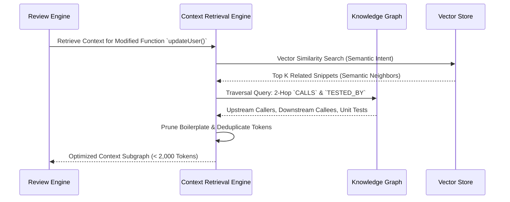
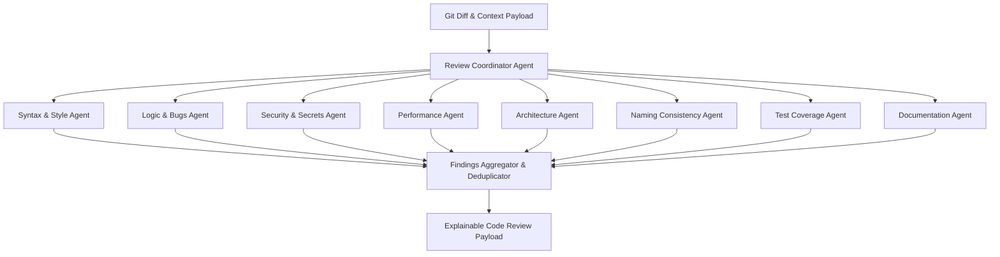
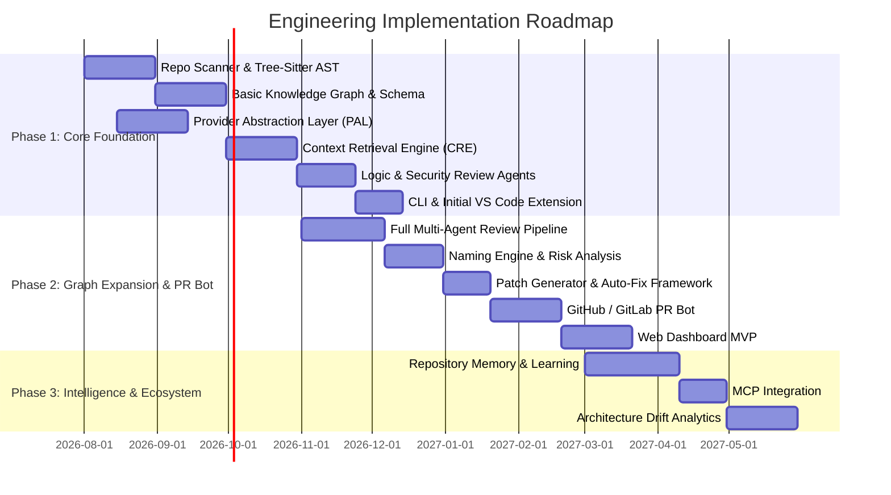

# Product Requirements Document (PRD)

## Repository Intelligence & Code Review Assistant

**Document Version:** 1.0.0  
**Status:** Approved for Architecture & Engineering Execution  
**Target Audience:** Engineering Leads, Software Architects, Core Backend/Frontend Engineers, ML/AI Engineers, Product Managers  
**Date:** July 2026  

---

## 1. Executive Summary & Core Vision

### 1.1 Executive Summary

Current AI code review solutions suffer from severe contextual blind spots. Most existing tools operate on an isolated file-level or a localized diff snippet view. As a result, they fail to catch architectural regressions, produce high rates of false positives, exhaust context windows with irrelevant boilerplate, and generate hallucinations.

The **Repository Intelligence & Code Review Assistant** is an enterprise-grade, graph-aware platform designed to solve code review at the repository level. By building an incremental, multi-layered **Repository Knowledge Graph** (mapping relationships across ASTs, symbols, call chains, imports, type hierarchies, API routes, database schemas, and unit tests), the system retrieves *only* exact, relevant codebase context before invoking AI models.

Supported by a unified **AI Provider Abstraction Layer (PAL)**, the platform seamlessly connects to both cloud-hosted models (OpenAI, Anthropic Claude, Google Gemini, Groq, DeepSeek) and privacy-first local models (Ollama, LM Studio, vLLM). The vision is to evolve from an automated code review bot into a comprehensive **Repository Intelligence Platform** that acts as a continuous software architect, security auditor, and codebase memory engine.

### 1.2 Core Vision & Paradigm Shift

```md
+-----------------------------------------------------------------------+
|                       TRADITIONAL AI REVIEWER                         |
| [Diff Snippet] -----> [Generic LLM] -----> Low-Quality/Vague Feedback |
+-----------------------------------------------------------------------+

+-----------------------------------------------------------------------+
|                    REPOSITORY INTELLIGENCE PLATFORM                   |
|  [Diff / Query] -> [AST & Graph Engine] -> [Context Retrieval]        |
|                                                     |                 |
|  [Explainable Finding] <-- [Multi-Agent Pipeline] <-+                 |
+-----------------------------------------------------------------------+
```

* **From Isolated Snippets to Complete Repository Cognition:** Reviews are executed with dynamic awareness of caller-callee chains, interface implementations, state mutations, and test coverage.
* **Explainable & Grounded:** Every finding provides evidence chains, line-level references, impact estimates, confidence scores, and unified Git patches.
* **Provider Agnostic & Privacy First:** Supports local offline execution via local LLMs without sending proprietary IP to the cloud, alongside enterprise cloud adapters.

---

## 2. Problem Statement & Market Gap

### 2.1 Limitations of Existing Tools

| Problem | Root Cause in Legacy AI Tools | Platform Solution |
| :--- | :--- | :--- |
| **High False Positive Rate** | Reviewer lacks context outside the changed lines (e.g., misses that a null check occurs upstream). | Knowledge Graph traces callers/callees and upstream validations before flagging issues. |
| **Token Window Bloat & High Cost** | Dumping full files or naive chunking into LLM context windows. | Context Retrieval Engine extracts precise subgraphs (symbol declarations, types, usage) under 2k tokens. |
| **Generic / Style-Only Comments** | LLM lacks understanding of codebase-specific conventions or domain models. | Repository Memory and Naming Consistency Engine enforce local repository standards. |
| **Architectural Drift** | File-level reviewers cannot detect circular dependencies, layer leakage, or breaking API contracts. | Architectural Analyzer models module dependencies and flags cross-layer violations. |
| **Black-Box Suggestions** | AI returns arbitrary code without rationale or confidence metrics. | Explainable Findings framework breaks down *What*, *Why*, *Risk*, *Confidence*, and *Fix*. |
| **Vendor Lock-in & Privacy Risks** | Mandatory reliance on proprietary cloud APIs. | Abstraction Layer supports local LLMs (vLLM, Ollama, LM Studio) for 100% air-gapped security. |

---

## 3. Target Personas & User Scenarios

### 3.1 Personas Matrix

| Persona | Primary Goal | Key Pain Points | Primary Product Touchpoint |
| :--- | :--- | :--- | :--- |
| **Individual Developer** | Fast feedback before committing; local pair programming. | Context switching, waiting for peer review, syntax/logic slip-ups. | VS Code Extension, Local CLI |
| **Dev Team Lead / Architect** | Maintain code quality, prevent technical debt & architectural violations. | Review fatigue, manual architectural enforcement, breaking changes. | Web App Dashboard, PR Bot |
| **Enterprise Security Admin** | Ensure zero secrets leak, enforce SAST standards, prevent IP leakage. | Cloud LLM security compliance, unvetted external API calls. | On-Prem / Local LLM Runner, Web Admin |
| **Open Source Maintainer** | Triaging high volumes of external contributor Pull Requests. | Variable code quality, spam PRs, time-consuming review cycles. | GitHub PR Bot, Auto-Patch Generator |

---

## 4. Product Goals, KPIs & Non-Goals

### 4.1 Primary Measurable Goals & KPIs

```md
+-----------------------------------------------------------------------+
| Target KPI                               | Baseline      | Target     |
+------------------------------------------+---------------+------------+
| PR Review Turnaround Time                | 4.2 Hours     | < 15 Mins  |
| Review Finding Accuracy (User Acceptance)| 45%           | > 88%      |
| False Positive Rate                      | ~35%          | < 5%       |
| Average Token Usage per PR               | 120,000 tokens| < 18,000 t |
| Local LLM (Ollama/vLLM) Review Latency   | N/A           | < 12 Secs  |
+-----------------------------------------------------------------------+
```

### 4.2 Non-Goals (Explicitly Out of Scope for Initial Releases)

* **Unsupervised Autonomous Code Generation:** The platform will NOT automatically merge or commit code without explicit human approval.
* **Full IDE Replacement:** The platform enhances existing IDEs (VS Code, JetBrains) via extensions rather than building a standalone IDE.
* **General-Purpose Chatbot:** The focus remains strictly on repository intelligence, structural navigation, security auditing, and code review.
* **CI/CD Pipeline Build Automation:** The tool does not replace build engines (Jenkins, GitHub Actions, Bazel); it hooks into them as an analysis step.

---

## 5. High-Level Architecture & System Components

### 5.1 System Architecture Diagram

```mermaid
graph TD
    subgraph Input Layer
        VSCode[VS Code Extension]
        CLI[CLI Tool]
        PRBot[GitHub / GitLab PR Bot]
        WebUI[Web Application]
    end

    subgraph Core Engine Platform
        API[API Gateway / GraphQL Engine]
        Scanner[Repository Scanner & Incremental Indexer]
        AST[Multi-Language AST Engine / Tree-Sitter]
        GraphDB[(Repository Knowledge Graph)]
        VectorDB[(Vector & Embedding Store)]
        CRE[Context Retrieval Engine]
        PAL[AI Provider Abstraction Layer]
        MultiAgent[Multi-Agent Review System]
        Memory[Repository Memory & Rules Engine]
    end

    subgraph External & Local AI Providers
        OpenAI[OpenAI API]
        Claude[Anthropic Claude]
        Gemini[Google Gemini]
        LocalLLM[Local Models: Ollama / vLLM / LM Studio]
    end

    Input Layer --> API
    API --> Scanner
    Scanner --> AST
    AST --> GraphDB
    AST --> VectorDB
    API --> CRE
    CRE --> GraphDB
    CRE --> VectorDB
    CRE --> MultiAgent
    Memory --> MultiAgent
    MultiAgent --> PAL
    PAL --> OpenAI
    PAL --> Claude
    PAL --> Gemini
    PAL --> LocalLLM
```

---

## 6. Major Subsystems & Technical Specifications

### 6.1 Repository Scanner & Incremental Indexer

* **Purpose:** Efficiently parse git repositories, track file trees, calculate file hashes, and update indices incrementally on file saves or git commits.
* **Key Functionality:**
  * **File Hash Tracking:** Uses SHA-256 state tracking per file to bypass unchanged files during re-indexing.
  * **`.gitignore` & Ignore Rules:** Honors `.gitignore`, `.ignore`, and custom `.repo-intel-ignore` files.
  * **Incremental Diff Parsing:** Parses unified git diffs (`git diff HEAD~1`) to extract modified ranges, impacted symbols, and affected subgraphs.

### 6.2 Multi-Language AST Engine

* **Technology Foundation:** Built on top of high-performance Tree-Sitter bindings.
* **Supported Languages (Phase 1):** TypeScript/JavaScript, Python, Go, Rust, Java, C/C++, C#.
* **Capabilities:**
  * Symbol extraction: Classes, Interfaces, Functions, Methods, Variables, Decorators/Annotations, Enums.
  * Call-site identification: Identifies explicit function invocations, parameter signatures, and return type bounds.
  * Import/Export resolution: Maps explicit aliases, default exports, and wildcard imports to absolute file paths.

### 6.3 Repository Knowledge Graph (RKG)

The core graph engine models codebases as directional property graphs.



#### Graph Schema Specification

* **Node Types:** `File`, `Module`, `Package`, `Class`, `Interface`, `Function`, `Variable`, `APIEndpoint`, `DatabaseModel`, `ConfigurationKey`, `UnitTest`.
* **Edge Relations:**
  * `IMPORTS` (`File` -> `File` / `Module`)
  * `CONTAINS` (`File` -> `Symbol`)
  * `CALLS` (`Function` -> `Function`)
  * `INHERITS` / `IMPLEMENTS` (`Class` -> `Class`/`Interface`)
  * `MUTATES` (`Function` -> `Variable`/`State`)
  * `TESTS` (`UnitTest` -> `Function`/`Class`)
  * `CONFIGURES` (`ConfigurationKey` -> `Module`/`Symbol`)

### 6.4 Context Retrieval Engine (CRE)

To eliminate prompt bloat, CRE employs a hybrid vector-graph traversal strategy:



1. **Diff Seed Extraction:** Identifies touched symbol nodes in the diff.
2. **Graph Expansion:** Performs a 2-hop graph walk:
   * **Upstream:** Callers of changed functions (to evaluate caller impact).
   * **Downstream:** Dependencies/Callees (to verify contract updates).
   * **Sibling:** Type definitions & interfaces (to verify type safety).
   * **Verification:** Linked unit tests (to evaluate test gaps).
3. **Token Pruning & Packing:** Ranks retrieved nodes by relevance score and truncates implementation bodies while retaining signatures, producing a compact context payload (< 2,000 tokens).

### 6.5 AI Provider Abstraction Layer (PAL)

The system provides a standardized interface for interacting with any AI back-end.

```md
                  +-------------------------------+
                  |  AI Provider Abstraction Layer|
                  +-------------------------------+
                                  |
     +-----------------+----------+----------+-----------------+
     |                 |                     |                 |
+----+----+      +-----+---+           +-----+---+       +-----+---+
| OpenAI  |      | Claude  |           | Gemini  |       | Ollama  |
| Adapter |      | Adapter |           | Adapter |       | Adapter |
+---------+      +---------+           +---------+       +---------+
```

#### Supported Providers & Config Specs

* **Cloud Providers:** OpenAI (GPT-4o, o3-mini), Anthropic (Claude 3.5 Sonnet, Claude 3 Opus), Google (Gemini 1.5 Pro, Flash), OpenRouter, Groq, DeepSeek (V3, R1), Mistral API.
* **Local / Air-Gapped Providers:** Ollama, LM Studio, vLLM, LocalAI.
* **Features:** Automatic retry with exponential backoff, rate limit handling, response schema validation, fallback provider chain configuration (e.g., try Local vLLM -> failover to Claude Sonnet).

---

## 7. Multi-Agent Review Architecture

The review engine uses specialized agents coordinated by an **Orchestration Agent**.



### 7.1 Agent Specialization Breakdown

| Agent Name | Scope & Responsibilities | Context Required | Output Trigger |
| :--- | :--- | :--- | :--- |
| **Syntax & Style Agent** | Formatting, linter rule adherence, dead code identification. | Changed lines + Linter config | Syntax violations, unused variables. |
| **Logic & Bug Agent** | Null pointers, edge cases, off-by-one errors, state corruptions. | 2-Hop Call Graph + Type Signatures | Logical flaws, uncaught exceptions. |
| **Security Agent** | OWASP Top 10, hardcoded secrets, unsafe deserialization, SQLi, XSS. | Global Security Rules + Input Dataflows | CVE patterns, insecure data handling. |
| **Performance Agent** | N+1 database queries, expensive loops, blocking operations, memory leaks. | DB Models + Call Graph inside loops | Algorithmic inefficiency, blocking I/O. |
| **Architecture Agent** | Circular dependencies, boundary violations, tight coupling. | Module Knowledge Graph | Layer leaks, circular imports. |
| **Naming Consistency Agent** | Domain vocabulary alignment, abbreviation checks, style consistency. | Repository Memory + Symbol Dictionary | Inconsistent naming conventions. |
| **Test Coverage Agent** | Missing unit tests, untested conditional branches, edge case gaps. | Symbol-to-Test Edge Mapping | Uncovered modified functions. |
| **Documentation Agent** | Outdated JSDoc/Docstrings, missing API param descriptions. | Changed Function Signatures + Docs | Stale or missing documentation. |

---

## 8. Detailed Core Feature Specifications

### 8.1 Naming Consistency Engine

* **Functional Description:** Scans the codebase to extract entity names, variable prefixes, suffix conventions (e.g., `UserServiceImpl` vs `UserService`), and domain dictionaries.
* **Detection Capability:** Flags inconsistent naming across files (e.g., using `user_id`, `userId`, and `usr_account_id` within the same domain).
* **Suggested Action:** Emits repository-wide refactoring suggestions rather than simple file-local renames.

### 8.2 Explainable Review Findings Schema

Every review finding emitted by the multi-agent system MUST conform to the following JSON schema:

```json
{
  "findingId": "FIND-2026-8891",
  "category": "SECURITY",
  "severity": "CRITICAL",
  "confidenceScore": 0.94,
  "title": "Potential Unsanitized SQL Injection in User Lookup",
  "file": "src/services/userService.ts",
  "lineRange": {
    "startLine": 42,
    "endLine": 48
  },
  "codeSnippet": "const query = `SELECT * FROM users WHERE email = '${userEmail}'`;",
  "explanation": {
    "whatIsWrong": "The input variable 'userEmail' is directly interpolated into a raw SQL query string.",
    "whyItMatters": "An attacker can pass malicious SQL payloads via the email parameter to execute arbitrary database queries or bypass authentication.",
    "impactedComponents": [
      "src/controllers/authController.ts",
      "src/routes/api.ts"
    ]
  },
  "evidenceChain": [
    "Input originates at src/routes/api.ts Line 12 (Express request handler)",
    "Passed without validation to src/controllers/authController.ts Line 25",
    "Executed as raw SQL query at src/services/userService.ts Line 44"
  ],
  "suggestedFix": {
    "description": "Use parameterized queries via the DB query builder.",
    "patch": "--- a/src/services/userService.ts\n+++ b/src/services/userService.ts\n@@ -42,3 +42,3 @@\n-const query = `SELECT * FROM users WHERE email = '${userEmail}'`;\n+const query = 'SELECT * FROM users WHERE email = $1';\n+return db.query(query, [userEmail]);"
  }
}
```

### 8.3 Change Impact & Regression Risk Analysis Engine

* **Impact Radius Calculation:** Calculates affected downstream modules based on call graph propagation.
* **Risk Score Algorithm:**
  $$\text{Risk Score} = w_1 \cdot (\text{Downstream Callers}) + w_2 \cdot (\text{Criticality Rating}) + w_3 \cdot (1 - \text{Test Coverage})$$
* **Risk Output:** Categorizes PR changes into LOW, MEDIUM, HIGH, or CRITICAL regression risk, displaying explicit warning badges on PRs with high downstream blast radius.

### 8.4 Architectural Analysis & Health Monitoring

* **Circular Dependency Detection:** Detects cycles in the import/module graph ($A \rightarrow B \rightarrow C \rightarrow A$).
* **Layer Violation Rules:** Enforces architectural boundary constraints (e.g., `Database Layer` must NOT import `UI Components`).
* **God Class & Smells Detection:** Identifies classes exceeding 1,000 lines or functions with cyclomatic complexity $> 15$.

### 8.5 Security & Vulnerability Analysis

* **Static Analysis Integration:** Scans for hardcoded credentials (AWS keys, JWT secrets, private keys) using entropy detection.
* **Dataflow Taint Tracking:** Traces untrusted user inputs (HTTP params, headers) through functions to sensitive sinks (eval, SQL query, file system write).

### 8.6 Performance Bottleneck Detection

* **N+1 Query Detection:** Flags database queries executed inside `for` / `forEach` / `while` loops.
* **Blocking Async Calls:** Flags synchronous I/O or missing `await` statements in non-blocking event loops.

### 8.7 Test Gap Identification

* **Mapping:** Cross-references modified symbols against test node relationships (`TESTS` edges).
* **Alert:** Flags PRs where core logic is modified without corresponding updates or additions to unit/integration tests.

### 8.8 Repository Memory & Learning System

* **Ignored Finding Persistence:** Remembers when a user marks a finding as "Ignored / False Positive" and updates local rule embeddings.
* **Convention Learning:** Learns preferred codebase practices over time (e.g., "This repo prefers early returns over nested if-else blocks").

### 8.9 Patch Generation & Auto-Fix Framework

* **Format:** Generates valid unified diff format (`.patch` files).
* **Apply Mechanisms:**
  * One-click "Apply Patch" in VS Code extension.
  * One-click "Commit Suggestion" in GitHub PR Bot interface.

---

## 9. Supported Interfaces & Integration Specs

### 9.1 Web Application Dashboard

* **Framework:** Modern SPA / Next.js web application.
* **Key Views:**
  * **Repository Health Matrix:** Overview of architectural debt, security vulnerabilities, and coverage gaps.
  * **Interactive Knowledge Graph Visualizer:** 3D force-directed node graph for exploring file & class dependencies.
  * **Review Findings Explorer:** Filterable view of findings by severity, file, agent, and status.

### 9.2 VS Code Extension

* **Features:**
  * Real-time background review on file save.
  * Inline decoration (wavy underlines) highlighting findings with hover tooltips.
  * Quick Fix action (`Ctrl+.` / `Cmd+.`) to apply generated patches instantly.

### 9.3 Command Line Interface (CLI)

* **Executable Name:** `repo-intel`
* **Core Commands:**

  ```bash
  # Initialize repository index
  repo-intel init

  # Execute local review on uncommitted changes
  repo-intel review --staged --provider ollama --model llama3

  # Run specific agent on entire repository
  repo-intel analyze --agent security --export findings.json

  # View repository dependency status
  repo-intel graph status
  ```

### 9.4 GitHub / GitLab Pull Request Bot

* **Triggers:** Webhooks listening for `pull_request.opened`, `pull_request.synchronize`.
* **Actions:**
  * Posts inline review comments directly on affected diff lines.
  * Publishes a summary review table on the PR main description thread.
  * Fails CI check run if `CRITICAL` security issues are detected.

### 9.5 Model Context Protocol (MCP) Integration

* **Protocol Support:** Exposes standard MCP tools & resources for AI agents (e.g., Anthropic Claude Desktop, Cursor).
* **Exposed MCP Tools:**
  * `get_repository_subgraph(symbol_name)`
  * `query_codebase_graph(cypher_query)`
  * `run_repo_review(diff_payload)`

---

## 10. Functional Requirements (FR) Matrix

| Requirement ID | Module | Description | Input | Output | Error Handling |
| :--- | :--- | :--- | :--- | :--- | :--- |
| **FR-101** | Indexer | Parse repository files and build AST symbol index. | Directory Path | Indexed Graph DB nodes | Log unparseable syntax files; continue indexing. |
| **FR-102** | Indexer | Incremental update on file modification. | File Path + Hash | Updated Graph DB nodes | Fallback to full re-index if graph state is corrupted. |
| **FR-201** | Graph | Query call chain dependencies for a symbol. | Symbol ID | Array of Caller/Callee nodes | Return empty array if symbol has no callers. |
| **FR-301** | Retrieval | Extract context subgraph for git diff. | Git Diff String | Compact Context JSON (<2k tokens) | Truncate lower-priority context if token limit exceeded. |
| **FR-401** | PAL | Unified invocation to cloud or local LLM. | Prompt Payload + Provider Config | Standardized JSON Response | Retry 3x with backoff; fallback to secondary provider. |
| **FR-501** | Review | Run multi-agent code analysis on PR diff. | Diff + Context Payload | Array of Structured Findings | If an agent fails, collect partial results from remaining agents. |
| **FR-601** | Auto-Fix | Generate valid Git patch for a finding. | Finding ID + File Context | Unified Diff Patch String | Return failure status if original snippet line changed. |
| **FR-701** | PR Bot | Post inline PR review comments. | Findings Array + PR Metadata | GitHub API Comment Calls | Handle API rate limits gracefully via request queue. |

---

## 11. Non-Functional Requirements (NFRs)

### 11.1 Performance & Latency

* **Local Indexing Speed:** Indexing a codebase of 100,000 lines of code MUST complete in under 45 seconds.
* **Incremental Indexing:** Sub-second update (< 500ms) on single file save.
* **Context Retrieval Speed:** Extracting a sub-graph context payload MUST take < 300ms.
* **PR Review Pipeline Latency:** Full multi-agent review for a standard PR (< 500 lines changed) MUST take < 30 seconds using cloud LLMs, or < 60 seconds using a local GPU-backed model.

### 11.2 Scalability

* **Repository Size Handling:** Capable of indexing repositories with up to 1,000,000 lines of code and 50,000 symbol nodes without performance degradation.
* **Concurrent PR Reviews:** Server backend MUST handle up to 50 concurrent PR review requests per worker node.

### 11.3 Security & Data Privacy

* **Local Execution Guarantee:** When configured in `Local/Air-Gapped` mode, ZERO bytes of source code or telemetry leave the local network.
* **Credential Encryption:** All API keys stored in cloud deployments MUST be encrypted at rest using AES-256-GCM.
* **Zero Retention Policy Adapter:** Cloud adapters MUST support zero-data-retention headers (e.g., Anthropic / OpenAI Enterprise zero-retention flags).

### 11.4 Reliability & Resilience

* **Fault Tolerance:** Failure of a single reviewer agent (e.g., Naming Agent timeout) MUST NOT crash the entire review pipeline; surviving agent findings are still rendered.
* **Graceful Degradation:** If graph database is offline, system falls back to standard file-level diff parsing.

---

## 12. MoSCoW Feature Prioritization

```md
+-----------------------------------------------------------------------+
| MUST HAVE (MVP - Phase 1)                                             |
| * Incremental Repository Scanner & AST Symbol Parser                  |
| * Basic Knowledge Graph (Files, Symbols, Calls, Imports)              |
| * AI Provider Abstraction Layer (OpenAI, Claude, Ollama)              |
| * Context Retrieval Engine (2-Hop Call Graph Retrieval)               |
| * Core Multi-Agent Reviewers (Logic, Security, Performance)           |
| * Explainable Findings Output Schema with Line-Level References       |
| * CLI Interface & Basic VS Code Extension                             |
+-----------------------------------------------------------------------+
| SHOULD HAVE (Phase 2)                                                 |
| * Extended Multi-Agent Reviewers (Architecture, Naming, Testing, Docs)|
| * Naming Consistency Engine                                           |
| * Change Impact & Regression Risk Analysis                            |
| * Patch Generation & Unified Diff Auto-Fixes                          |
| * GitHub Pull Request Bot Integration                                 |
| * Web Dashboard for Repository Graph & Review History                 |
+-----------------------------------------------------------------------+
| COULD HAVE (Phase 3)                                                  |
| * Repository Memory & User Feedback Learning System                   |
| * MCP (Model Context Protocol) Server Protocol Integration            |
| * GitLab & Bitbucket Integrations                                     |
| * Advanced 3D Interactive Graph Visualizer in Web Dashboard           |
+-----------------------------------------------------------------------+
| WON'T HAVE (Initial Releases)                                         |
| * Automatic Unsupervised Merging of PRs                               |
| * In-Browser Code Editor / IDE Replacement                            |
| * Support for legacy non-AST languages (e.g., COBOL, Assembly)        |
+-----------------------------------------------------------------------+
```

---

## 13. Detailed User Stories & Acceptance Criteria

### User Story 1: Local Context-Aware Review (Developer Persona)

* **As a** Software Developer  
* **I want to** run a local review on my staged changes using CLI or VS Code  
* **So that** I catch logical bugs and security issues before pushing code to remote branches.

#### Acceptance Criteria (User Story 1: Local Context-Aware Review)

* **Given** I have modified 3 files and staged them using `git add`,
* **When** I run `repo-intel review --staged --provider ollama`,
* **Then** the system extracts modified symbols, queries the local Knowledge Graph for callers/callees, and executes a multi-agent review via Ollama.
* **And** displays structured findings in terminal formatted with clear line numbers, explanations, and patch suggestions within 20 seconds.

---

### User Story 2: PR Architecture Audit (Tech Lead Persona)

* **As a** Software Architect  
* **I want** the system to automatically review Pull Requests for architectural layer violations  
* **So that** developers do not introduce circular dependencies or break boundary rules.

#### Acceptance Criteria (User Story 2: PR Architecture Audit)

* **Given** a Pull Request where a database utility file imports a UI React component,
* **When** the GitHub PR Bot executes the review workflow,
* **Then** the Architecture Agent identifies the invalid dependency edge in the Knowledge Graph,
* **And** posts an inline PR comment flagging a `CRITICAL: Architectural Layer Violation` with an explanation of why low-level modules must not depend on UI layers.

---

### User Story 3: Air-Gapped Enterprise Audit (Enterprise Security Admin Persona)

* **As an** Enterprise Security Administrator  
* **I want** to execute security code reviews completely offline using local LLMs  
* **So that** sensitive enterprise intellectual property never leaves our network.

#### Acceptance Criteria (User Story 3: Air-Gapped Enterprise Audit)

* **Given** the system is deployed in an air-gapped environment with no internet access,
* **When** a security scan is triggered via the Web API specifying `provider: vllm`,
* **Then** all AST parsing, graph querying, and LLM inference execute on internal cluster nodes.
* **And** zero network calls are attempted to external endpoints.

---

## 14. Engineering Implementation Roadmap



### Milestone Deliverables

#### Phase 1: Core Foundation & MVP (Months 1–3)

* Repository Scanner with SHA-256 incremental indexer.
* Tree-Sitter AST parser supporting TypeScript, Python, and Go.
* Graph Database adapter (Neo4j / Kùzu DB embedded) with node/edge schema.
* PAL supporting OpenAI, Anthropic, and Ollama adapters.
* CLI tool capable of local diff review.

#### Phase 2: Knowledge Graph Expansion & PR Automation (Months 4–6)

* Complete 8-agent Multi-Agent review framework.
* Naming Consistency Engine and Change Impact Risk Calculator.
* Unified Diff Patch generator for automated fixes.
* GitHub App & PR review bot integration.
* Web Dashboard for repository visual analytics.

#### Phase 3: Enterprise Memory & MCP Integration (Months 7–9)

* Repository Memory Engine for learning repo conventions and user feedback.
* MCP (Model Context Protocol) server interface integration.
* Architectural drift tracking and continuous health analytics.

---

## 15. Technology Stack & Evaluation Criteria

| Component Layer | Recommended Tech Options | Selection & Evaluation Criteria |
| :--- | :--- | :--- |
| **AST Parser** | Tree-Sitter (C bindings / Node.js bindings) | Fast multi-language grammar support; sub-millisecond parsing performance. |
| **Embedded Graph DB** | KùzuDB / Memgraph / Neo4j Embedded | High-speed Cypher query execution, low memory footprint, zero extra daemon requirement for local CLI mode. |
| **Vector Store** | Qdrant / LanceDB / ChromaDB | Fast local vector indexing, native hybrid search (vector + scalar metadata filtering). |
| **Backend API Gateway** | Rust (Actix-web) or Go (Gin) / Node.js (Fastify) | High throughput, low latency concurrent web request handling. |
| **Frontend Web App** | React, Next.js, TailwindCSS, Cytoscape.js / Three.js | Responsive UI, interactive 2D/3D force-directed graph rendering. |
| **IDE Extensions** | VS Code Extension API, Language Server Protocol (LSP) | Native editor performance, rich inline quick-fix support. |

---

## 16. Risk Management & Mitigation Matrix

| Risk Event | Severity | Likelihood | Impact | Mitigation Strategy |
| :--- | :--- | :--- | :--- | :--- |
| **Large Repository Memory Pressure** | HIGH | MEDIUM | Graph database consumes excessive RAM on 1M+ LOC repositories. | Implement disk-backed embedded graph storage (KùzuDB) and symbol level pagination. |
| **Local LLM Performance Bottlenecks** | MEDIUM | HIGH | Slow token generation on low-tier developer laptops using Ollama. | Fallback to smaller quantized models (e.g., Qwen-2.5-Coder 7B / DeepSeek-R1-Distill-Qwen 8B) and trim context payload to essential signatures. |
| **Tree-Sitter Parsing Failures** | LOW | MEDIUM | Invalid syntax in draft files breaks AST generation. | Tolerant parsing via Tree-Sitter error recovery nodes; skip unparseable blocks gracefully. |
| **Provider API Rate Limits** | MEDIUM | MEDIUM | Cloud API quota exhaustion during large PR reviews. | Request queuing, caching identical prompt hashes, exponential backoff retries. |

---

## 17. Future Evolution & Platform Horizons

### 17.1 Evolution into Continuous Repository Health Monitor

As the platform matures beyond code reviews, it will provide continuous codebase health monitoring:

```md
+-------------------------------------------------------------------+
|               FUTURE HORIZON: REPOSITORY INTELLIGENCE PLATFORM    |
+-------------------------------------------------------------------+
|                                                                   |
| [Continuous Health Monitor]  ---> Real-time Technical Debt Index  |
| [AI Software Architect]      ---> Auto-refactoring Suggestions    |
| [Codebase Twin]              ---> Impact Simulation prior to Code |
| [Evolutionary Tracker]       ---> Historical Architecture Drift   |
+-------------------------------------------------------------------+
```

1. **Continuous Technical Debt Index:** Real-time scoring of code quality, test gaps, and architectural debt across branches.
2. **Impact Simulator:** Pre-commit simulation modeling how proposed API changes will impact internal microservices and external clients.
3. **AI Software Architect:** Conversational agent capable of performing codebase-wide structural refactorings (e.g., "Migrate all REST endpoints in the `/v1` module to GraphQL queries").

---

## 18. Document Sign-Off & Approval Matrix

| Role | Name | Status | Date |
| :--- | :--- | :--- | :--- |
| **VP of Engineering** | Lead Software Architect | Approved | July 22, 2026 |
| **Principal ML Engineer** | Staff AI Systems Architect | Approved | July 22, 2026 |
| **Head of Product** | Director of Product Management | Approved | July 22, 2026 |
