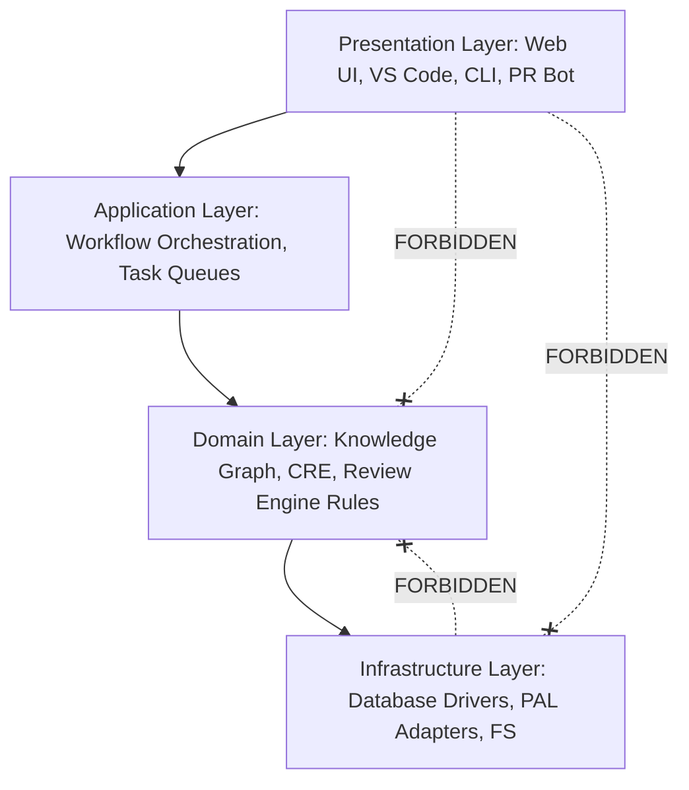
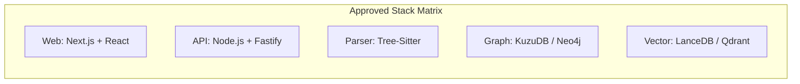
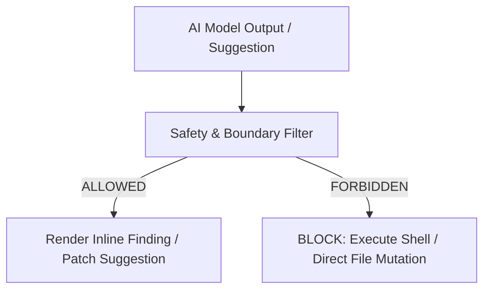
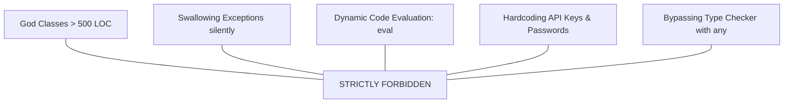

# Engineering Standards & Governance Rules: Repository Intelligence & Code Review Platform

**Document Version:** 1.0.0  
**Status:** Mandatory Engineering Specification  
**Target Audience:** Core Software Engineers, AI System Engineers, Technical Leads, Human Contributors, and AI Coding Assistants  
**Date:** July 2026

---

## Document Conventions (RFC 2119)

The key words **MUST**, **MUST NOT**, **REQUIRED**, **SHALL**, **SHALL NOT**, **SHOULD**, **SHOULD NOT**, **RECOMMENDED**, **MAY**, and **OPTIONAL** in this document are to be interpreted as described in [RFC 2119](https://datatracker.ietf.org/doc/html/rfc2119).

- **Mandatory Rules (MUST / MUST NOT):** Non-negotiable engineering requirements. PRs violating these rules **MUST** be blocked.
- **Recommended Practices (SHOULD / SHOULD NOT):** Strongly encouraged guidelines. Deviations **MUST** provide explicit technical justification.
- **Optional Guidelines (MAY):** Discretionary preferences left to the implementation team.

---

## 1. Core Engineering Principles

1. **Simplicity Over Cleverness:** Developers and AI assistants **MUST** write clear, straightforward code. Over-engineered abstractions or "clever" code tricks that reduce readability **MUST NOT** be merged.
2. **Readability Over Brevity:** Code **MUST** prioritize clarity and self-documentation over short variable names or dense one-liners.
3. **Composition Over Inheritance:** Class hierarchies **MUST NOT** exceed 2 levels of inheritance. Developers **MUST** prefer object composition and trait/interface delegation.
4. **Explicit Over Implicit:** Magic behaviors, reflection-based dependency resolution, dynamic monkey-patching, and implicit type coercions **MUST NOT** be used.
5. **Interfaces Over Implementations:** Modules **MUST** depend on abstract interfaces rather than concrete implementations to ensure decoupling and testability.
6. **Dependency Injection (DI):** Shared services **MUST** be passed explicitly via constructor parameters or factory dependency injection. Singletons and global states **MUST NOT** be used.
7. **Single Responsibility Principle (SRP):** Every module, class, and function **MUST** have exactly one reason to change.
8. **Fail Fast & Defensive Programming:** Input parameters **MUST** be validated at boundary entry points. Programs **MUST** fail fast with explicit error types rather than propagating invalid state.
9. **Backward Compatibility:** API contracts, database schemas, and CLI parameter flags **MUST** preserve backward compatibility unless a major version bump is explicitly approved.

---

## 2. Architecture Rules & Boundary Enforcement

The platform follows a strict 4-tier unidirectionally layered architecture:

$$\text{Presentation Layer} \longrightarrow \text{Application Layer} \longrightarrow \text{Domain Layer} \longrightarrow \text{Infrastructure Layer}$$



### Boundary Enforcement Rules

1. **No Circular Dependencies:** Circular imports between packages or files **MUST NOT** exist. Circularity **MUST** be validated automatically by build tools.
2. **Domain Isolation:** The Domain Layer **MUST NOT** import any web framework, React component, CLI UI renderer, or editor SDK.
3. **Provider Isolation:** AI Provider Abstraction Layer (PAL) adapters **MUST NOT** depend on frontend code, API HTTP handlers, or CLI parsers.
4. **Shared Utility Purity:** Package utilities in `packages/shared/` **MUST** remain 100% framework-independent and side-effect free.
5. **No Business Logic in Controllers:** Controllers, HTTP route handlers, and CLI commands **MUST NOT** execute domain logic directly; they **MUST** delegate to Application Layer service orchestrators.
6. **Graph Engine Isolation:** The Repository Knowledge Graph (RKG) engine **MUST NOT** invoke AI LLM models directly. Graph retrieval and LLM prompt processing **MUST** be decoupled via the Context Retrieval Engine.

---

## 3. Folder Responsibilities & Structure Rules

The project is structured as a strict monorepo. Every file **MUST** reside within its designated folder hierarchy.

```text
repo-intelligence-platform/
├── apps/                        # Executable application entrypoints ONLY
│   ├── web/                     # Web Dashboard Application (Next.js)
│   ├── vscode/                  # VS Code Extension Client
│   └── cli/                     # CLI Tool (`repo-intel`)
├── packages/                    # Decoupled core business domain packages ONLY
│   ├── parser/                  # Tree-Sitter AST Parsers
│   ├── graph/                   # Knowledge Graph Schema & Engine
│   ├── retrieval/               # Context Retrieval Engine (CRE)
│   ├── ai/                      # Provider Abstraction Layer (PAL)
│   ├── review-engine/           # Multi-Agent Review Orchestrator
│   ├── agents/                  # Specialized Review Agents
│   ├── patch-gen/               # Patch Generator & Auto-Fix Engine
│   └── shared/                  # Common TypeScript interfaces & utilities
├── services/                    # Background infrastructure services ONLY
│   ├── api/                     # Backend API Gateway Service
│   ├── indexing/                # Incremental Indexing Background Worker
│   └── pr-bot/                  # GitHub / GitLab PR Webhook Service
├── configs/                     # System configs, linter rules, and defaults
├── docs/                        # Specifications, manuals, and API specs
├── scripts/                     # Developer tooling & deployment scripts
└── tests/                       # Cross-package E2E integration test suites
```

### Folder Strict Rules

- Generic "dumping ground" folders like `src/utils/`, `src/helpers/`, or `src/common/` **MUST NOT** be created.
- Business logic **MUST NOT** be placed inside `apps/`. Applications are thin wrappers connecting `packages/` and `services/`.

---

## 4. Module Design Rules

1. **Minimal Public API:** Every module **MUST** export only what is strictly necessary through an `index.ts` barrier file. Internal module helpers **MUST NOT** be exported.
2. **Encapsulation:** Implementation details (internal helper functions, internal state, private helper classes) **MUST** remain private.
3. **Independent Testability:** Modules **MUST** be testable in complete isolation without requiring real network connections or active database instances.
4. **No Global State:** Modules **MUST NOT** maintain mutable global variables or module-level singletons.

---

## 5. Coding Standards

1. **Meaningful Naming:** Variables and functions **MUST** express clear intent (e.g., `calculateDownstreamRiskScore()` instead of `calc()`).
2. **Small Functions:** Functions **SHOULD NOT** exceed 30 lines of code. Functions exceeding 50 lines **MUST** be refactored.
3. **Small Classes:** Classes **SHOULD NOT** exceed 200 lines of code.
4. **No Magic Numbers or Strings:** Constants **MUST** be named explicitly in UPPER_SNAKE_CASE or enumerated in `enum` / `as const` object structures.
5. **DRY (Don't Repeat Yourself):** Logic duplicated across 2 or more files **MUST** be extracted into a shared helper function.
6. **Immutable Data:** Variables **MUST** use `const` by default. Objects and arrays **SHOULD** be treated as immutable using spread operations or read-only types.
7. **Strict Typing:** TypeScript `any` type **MUST NOT** be used. Disabling type-checking (`@ts-ignore`) **MUST NOT** be committed without written tech lead approval.
8. **Avoid Nesting:** Code nesting **MUST NOT** exceed 3 levels. Code **MUST** leverage early returns (guard clauses) to handle error conditions first.

```typescript
// MANDATORY GUARD CLAUSE PATTERN
function processSymbol(symbol: SymbolNode | null): ExecutionResult {
  if (!symbol) {
    return { success: false, reason: "SYMBOL_NULL" };
  }
  if (!symbol.isValid) {
    return { success: false, reason: "SYMBOL_INVALID" };
  }

  // Core processing logic without deep nesting
  return executeSymbolAnalysis(symbol);
}
```

---

## 6. Naming Conventions Matrix

| Entity Type                 | Convention                       | Example                        |
| :-------------------------- | :------------------------------- | :----------------------------- |
| **Files (Code)**            | kebab-case                       | `symbol-resolver.ts`           |
| **Files (React Component)** | PascalCase                       | `FindingsTable.tsx`            |
| **Directories**             | kebab-case                       | `review-engine/`               |
| **Variables & Functions**   | camelCase                        | `extractSubGraph()`            |
| **Global Constants**        | UPPER_SNAKE_CASE                 | `MAX_TOKEN_BUDGET`             |
| **Interfaces & Types**      | PascalCase                       | `SymbolNode`, `ProviderConfig` |
| **Classes**                 | PascalCase                       | `ContextRetrievalEngine`       |
| **Enums**                   | PascalCase (Keys: UPPER_SNAKE)   | `Severity.CRITICAL`            |
| **React Hooks**             | camelCase with `use` prefix      | `useKnowledgeGraph()`          |
| **Review Agents**           | PascalCase with `Agent` suffix   | `SecurityAgent`                |
| **AI Providers**            | PascalCase with `Adapter` suffix | `OllamaAdapter`                |

---

## 7. Technology Stack Rules & Selection Matrix



| Category            | Preferred Technology        | Allowed Alternatives   | Prohibited (Avoid)     | Rationale                                                           |
| :------------------ | :-------------------------- | :--------------------- | :--------------------- | :------------------------------------------------------------------ |
| **Frontend Web**    | Next.js, React, TailwindCSS | React SPA (Vite)       | Angular, jQuery, Vue 2 | SSR capability, performance, rich graph rendering ecosystem.        |
| **Backend API**     | Node.js (Fastify)           | Go (Gin), Rust (Actix) | Express.js, NestJS     | Fastify provides 2x throughput over Express with lower overhead.    |
| **AST Parser**      | Tree-Sitter                 | Native compiler ASTs   | RegEx line scanning    | Fast multi-language grammar parsing with sub-millisecond execution. |
| **Knowledge Graph** | KùzuDB (Embedded)           | Neo4j, Memgraph        | MySQL, MongoDB         | Embedded Cypher graph queries with zero extra background daemons.   |
| **Vector DB**       | LanceDB (Embedded)          | Qdrant                 | Pinecone (Cloud-only)  | Disk-backed embedded storage enabling 100% offline air-gapped run.  |
| **Caching**         | Redis / Keyv                | Node-cache             | Unbounded JS Map       | Redis scales out in cloud; Keyv provides embedded fallback.         |

---

## 8. Library & Dependency Rules

1. **Dependency Minimization:** Native Node.js / Web APIs (`fetch`, `crypto`, `fs/promises`) **MUST** be used instead of external micro-libraries (e.g., `axios`, `lodash`).
2. **Version Pinning:** Production dependencies **MUST** be pinned to exact versions in `package.json` (no `^` or `~` ranges).
3. **Prohibited Packages:** Packages with known critical vulnerabilities, unmaintained projects (> 12 months inactive), or heavy utility packages (`moment.js`, `bluebird`) **MUST NOT** be added.

---

## 9. AI Provider Rules & Interfaces

1. **Common Abstraction Interface:** Every AI provider **MUST** implement the `ProviderAdapter` interface defined in `packages/ai/src/base/provider-interface.ts`.
2. **No Provider Leaks:** Provider-specific API schemas or tokens (e.g., `OpenAI-Organization` headers or Anthropic prompt delimiters) **MUST NOT** leak into the core review engine.
3. **Configuration-Driven Provider Selection:** Switching providers **MUST** be achieved solely through configuration changes (`provider: "ollama"`), requiring zero code modifications.
4. **Required Provider Support:** The platform **MUST** natively support OpenAI, Anthropic Claude, Google Gemini, Ollama, vLLM, OpenRouter, DeepSeek, and Groq adapters.

---

## 10. AI Execution Boundaries & Guardrails

To guarantee safety, predictability, and data privacy, AI models are subject to hard operational boundaries:



### Hard AI Boundaries Matrix

| Category              | Permitted AI Actions (ALLOWED)                       | Prohibited AI Actions (FORBIDDEN)                         |
| :-------------------- | :--------------------------------------------------- | :-------------------------------------------------------- |
| **Code Modification** | Generate unified diff patch strings for user review. | Automatically write to disk or merge git branches.        |
| **Execution**         | Analyze AST nodes and prompt payloads.               | Execute arbitrary shell commands or run unvetted scripts. |
| **Secrets & Keys**    | Mask detected secrets using security rules.          | Access, inspect, or log system credentials or API keys.   |
| **Network Requests**  | Route requests to configured LLM provider APIs.      | Make arbitrary external HTTP calls to unlisted endpoints. |
| **Source Storage**    | Process context subgraphs transiently in memory.     | Store user source code on external third-party servers.   |

---

## 11. Prompt Engineering Rules

1. **No Business Logic in Prompts:** Prompts **MUST NOT** contain application logic or fallback rules. Prompts are templates for formatting code context.
2. **Structured Output Enforcement:** Prompts **MUST** instruct LLMs to respond strictly in valid JSON matching predefined TypeScript interfaces.
3. **Token Efficiency:** Context payloads **MUST** be pruned by the Context Retrieval Engine to remain under 2,000 tokens per prompt.
4. **Prompt Versioning:** System prompts **MUST** be versioned in code (`prompts/v1/security-agent.ts`) to enable regression testing.

---

## 12. Error Handling & Exception Rules

1. **No Swallowing Exceptions:** Catch blocks **MUST NOT** be empty (`try { ... } catch (e) {}`). All caught exceptions **MUST** be logged or handled.
2. **Custom Typed Errors:** Domain errors **MUST** inherit from `BaseDomainError` (e.g., `ASTParsingError`, `GraphTraversalError`, `ProviderTimeoutError`).
3. **Structured Error Objects:** API and system errors **MUST** return a standardized payload format:

```json
{
  "errorCode": "PROVIDER_TIMEOUT",
  "message": "Ollama local runner timed out after 30000ms",
  "details": { "provider": "ollama", "model": "llama3" },
  "timestamp": "2026-07-22T14:50:00Z"
}
```

---

## 13. Logging & Observability Rules

1. **Structured JSON Logging:** All log entries **MUST** be emitted as JSON objects containing `timestamp`, `level`, `correlationId`, `service`, and `message`.
2. **Log Levels:**
   - `ERROR`: Critical failures requiring immediate engineering attention.
   - `WARN`: Transient issues or fallback triggers (e.g., primary provider failover).
   - `INFO`: Major lifecycle milestones (e.g., repository index completed).
   - `DEBUG`: Detailed diagnostic traces (disabled in production by default).
3. **Zero Secrets in Logs:** API keys, authorization tokens, passwords, and raw source code snippets **MUST NOT** appear in log outputs under any circumstance.

---

## 14. Security Rules & Data Privacy

1. **Encryption at Rest & In Transit:** Secrets and keys **MUST** be encrypted using AES-256-GCM. All API network traffic **MUST** enforce TLS 1.3.
2. **Air-Gapped Mode Guarantee:** When set to `local` execution mode, network adapter modules **MUST** reject outbound requests to non-localhost URLs.
3. **Input Sanitization:** User diff strings and search queries **MUST** be sanitized to prevent command injection and Cypher query injection attacks.

---

## 15. Performance Rules

1. **Incremental Indexing:** Repositories **MUST NOT** be fully re-indexed on file save. Analysis **MUST** operate strictly on diff state and updated file hashes.
2. **Sub-Second Local Operations:** Local AST symbol extraction and graph updates **MUST** complete in under 500ms for individual file edits.
3. **Context Payload Limit:** Retrieved context subgraphs **MUST NOT** exceed 2,000 tokens per review agent invocation.

---

## 16. Repository Intelligence Rules

1. **AST AST-Grounded Context:** AI models **MUST NOT** be asked to infer symbol definitions. All declarations **MUST** be provided via Tree-Sitter AST resolution.
2. **Graph Consistency:** Knowledge Graph nodes and edges **MUST** be updated atomically during file saves.

---

## 17. Review Engine Rules

Every review finding emitted by human reviewers or AI agents **MUST** include all mandatory fields:

$$\text{Finding} = \{ \text{findingId, category, severity, confidenceScore, file, lineRange, explanation, evidenceChain, suggestedFix} \}$$

Vague or non-actionable findings (e.g., "This code could be better") **MUST NOT** be emitted by any review agent.

---

## 18. Code Fix Rules

1. **Minimal Diff Footprint:** Suggested patches **MUST** touch only the lines directly relevant to the finding. Unrelated refactoring **MUST NOT** be included.
2. **Preserve Code Formatting:** Auto-generated fixes **MUST** conform to the target file's existing indentation and code style.

---

## 19. Testing Expectations & Standards

1. **Unit Test Coverage:** Core domain packages (`parser`, `graph`, `retrieval`, `ai`, `review-engine`) **MUST** maintain $\ge 85\%$ unit test branch coverage.
2. **Integration Testing:** Every AI Provider adapter **MUST** pass integration test suites against mock provider endpoints.
3. **Regression Tests:** Every bug fix **MUST** include a regression test verifying that the issue does not reoccur.

---

## 20. Documentation Standards

1. **Package READMEs:** Every package inside `packages/` and service in `services/` **MUST** contain a `README.md` explaining purpose, public API, configuration, and testing commands.
2. **Inline JSDoc:** All public functions, interfaces, and classes **MUST** be documented using JSDoc / TSDoc annotations.

---

## 21. API Design Rules

1. **RESTful Conventions:** APIs **MUST** use standard HTTP verbs (`GET`, `POST`, `PUT`, `DELETE`) and plural resource nouns (`/api/v1/reviews`).
2. **API Versioning:** All endpoints **MUST** include explicit URI versioning (`/v1/`).
3. **Pagination:** Endpoints returning collections **MUST** enforce pagination via `page` and `limit` parameters.

---

## 22. Configuration Management

1. **Environment Variables:** Environment-specific settings **MUST** be loaded via environment variables (`process.env`).
2. **Schema Validation:** Configuration parameters **MUST** be validated at startup using Zod or equivalent schema validator. Missing required variables **MUST** crash the service immediately on launch.

---

## 23. Git & Commit Guidelines

1. **Conventional Commits:** Commit messages **MUST** follow the [Conventional Commits](https://www.conventionalcommits.org/) specification:
   - `feat: add Tree-Sitter parser for Rust language`
   - `fix(graph): resolve circular import deadlock during 2-hop traversal`
   - `docs: update rules.md with security guidelines`
2. **Feature Branch Workflow:** All development **MUST** occur on feature branches (`feat/add-ollama-adapter`). Direct commits to `main` **MUST** be blocked.

---

## 24. Dependency Management Rules

1. **Monorepo Workspace Management:** Monorepo dependencies **MUST** be managed using `pnpm` workspaces.
2. **No Duplicate Packages:** Monorepo packages **MUST** reuse shared dependency versions declared at the root level.

---

## 25. Plugin Architecture Rules

1. **Isolating External Plugins:** Plugins **MUST** run inside sandboxed execution contexts.
2. **Stable Extension APIs:** Plugins **MUST** interact with the platform exclusively through frozen, versioned extension interfaces.

---

## 26. Code Review Guidelines

Human reviewers and AI agents **MUST** evaluate pull requests against the checklist:

- [ ] Conforms to architecture layers and directory structure.
- [ ] No circular dependencies or framework leaks in domain modules.
- [ ] 100% strict TypeScript types (zero `any`).
- [ ] Unit tests added and passing.
- [ ] Security standards and air-gapped guarantees preserved.

---

## 27. Scalability & Distributed Execution Rules

1. **Stateless Service Design:** Services **MUST** remain stateless to allow horizontal auto-scaling across Kubernetes worker pods.
2. **Asynchronous Background Processing:** Heavy indexing and multi-agent reviews **MUST** execute asynchronously via task queues (BullMQ / Redis).

---

## 28. Future-Proofing Rules

1. **Language Parser Decoupling:** Adding support for a new programming language **MUST** require only creating a new Tree-Sitter grammar module in `packages/parser/`, with zero modifications to the core Graph Engine.
2. **Provider Decoupling:** Adding a new AI model provider **MUST** require only instantiating a new class implementing `ProviderAdapter`.

---

## 29. Critical Anti-Patterns (Things to Avoid)



### Prohibited Code Anti-Patterns

- **God Classes:** Classes containing thousands of lines handling multiple unrelated concerns.
- **Massive Utility Dumping Grounds:** Creating `utils.ts` files containing unrelated helper functions.
- **Hardcoded Model Logic:** Embedding model-specific prompt tricks inside core business services.
- **Blocking Synchronous I/O:** Executing synchronous file reads (`readFileSync`) or blocking thread sleeps on event loop threads.
- **Premature Optimization:** Adding complex caching or micro-optimizations without empirical performance benchmarks.

---

## 30. Rules for AI Coding Assistants

These rules **MUST** be strictly obeyed by all AI coding assistants (including Antigravity, GitHub Copilot, Cursor, and automated code generation bots) operating on this codebase:

1. **Obey Architecture & Directory Rules:** AI assistants **MUST** place files strictly in accordance with Section 3.
2. **Never Invent APIs or Symbols:** AI assistants **MUST NOT** hallucinate unimported package functions or non-existent external library methods.
3. **Modify Existing Files Over Creating New Ones:** AI assistants **SHOULD** modify and refactor existing modules rather than proliferating duplicate helper files.
4. **Preserve Comments & Docstrings:** Existing code documentation **MUST NOT** be stripped or deleted during refactoring.
5. **No Production Placeholders:** AI assistants **MUST NOT** emit placeholder implementations (`// TODO: implement later` or `throw new Error("Not implemented")`) in production code.
6. **Strict Compliance with Types:** AI assistants **MUST** generate fully typed TypeScript code without introducing `any` or disabling type checks.
